# THE BROKER
## Enterprise Threat Hunt Report

| Field | Detail |
|---|---|
| **Hunt Name** | The Broker |
| **Organisation** | Ashford Sterling Recruitment |
| **Environment** | Microsoft Defender for Endpoint |
| **Query Language** | Kusto Query Language (KQL) |
| **Timeframe Investigated** | January 15 2026 |
| **Analyst** | Carlos Funezsanchez |
| **Version** | 1.0 |
| **Report Date** | 25 February 2026 |
| **Total Flags** | 40 |

---

## TABLE OF CONTENTS

1. [Executive Summary](#1-executive-summary)
2. [Hunt Methodology](#2-hunt-methodology)
3. [Attack Chain Timeline](#3-attack-chain-timeline)
4. [Findings Overview](#4-findings-overview)
5. [Detailed Findings](#5-detailed-findings)
   - [Section 1 — Initial Access](#section-1--initial-access)
   - [Section 2 — Command & Control](#section-2--command--control)
   - [Section 3 — Credential Access](#section-3--credential-access)
   - [Section 4 — Discovery](#section-4--discovery)
   - [Section 5 — Persistence: Remote Tool](#section-5--persistence-remote-tool)
   - [Section 6 — Lateral Movement](#section-6--lateral-movement)
   - [Section 7 — Persistence: Scheduled Task](#section-7--persistence-scheduled-task)
   - [Section 8 — Data Access](#section-8--data-access)
   - [Section 9 — Anti-Forensics & Memory](#section-9--anti-forensics--memory)
6. [IOC Table](#6-ioc-table)
7. [MITRE ATT&CK Mapping](#7-mitre-attck-mapping)
8. [Recommendations](#8-recommendations)
9. [Conclusion](#9-conclusion)

---

## 1. EXECUTIVE SUMMARY

Between 15 January 2026, Ashford Sterling Recruitment experienced a structured, operator-driven enterprise compromise. A malicious executable disguised as a candidate CV (`Daniel_Richardson_CV.pdf.exe`) was executed on workstation **as-pc1**, establishing command-and-control communications with adversary infrastructure at `cdn.cloud-endpoint.net`. The attacker dumped local credential registry hives (SAM and SYSTEM), conducted reconnaissance, and deployed AnyDesk as a persistent remote access backdoor across all three hosts. Using harvested credentials, the adversary pivoted laterally via RDP from **as-pc1** through **as-pc2** to the file server **as-srv**, accessed and edited sensitive payroll data (`BACS_Payments_Dec2025.ods`), and staged it for exfiltration inside `Shares.7z`. Before exiting, Windows Security and System logs were cleared, and SharpChrome was reflectively loaded into `notepad.exe` to harvest browser-stored credentials without touching disk.

The overall risk posture is assessed as **Critical**. Across 40 discrete flags spanning 9 attack phases, the adversary demonstrated deliberate tradecraft including LOLBin abuse, process masquerading, fileless execution, and multi-layer persistence. The targeting of BACS payment documents — with confirmed editing activity — raises the possibility of financial fraud beyond simple data theft. Immediate containment, enterprise credential rotation, forensic imaging of all affected hosts, and removal of all persistence mechanisms are required without delay.

---

## 2. HUNT METHODOLOGY

### Hypothesis
An adversary gained initial access via a phishing payload and leveraged credential theft to enable lateral movement across the enterprise environment, targeting sensitive financial data for exfiltration.

### Data Sources Queried

| Source | MDE Table | Purpose |
|---|---|---|
| Process telemetry | `DeviceProcessEvents` | Execution chain, LOLBin abuse, persistence, recon |
| Network telemetry | `DeviceNetworkEvents` | C2 communication, outbound connections |
| File events | `DeviceFileEvents` | File creation, staging, archive activity |
| Logon events | `DeviceLogonEvents` | Lateral movement, account activation |
| Device events | `DeviceEvents` | Memory loading, advanced detections |

### Scope

| Field | Detail |
|---|---|
| **Primary Host** | as-pc1 |
| **Secondary Hosts** | as-pc2, as-srv |
| **Timeframe** | 2026-01-15T00:00:00Z |
| **Hunt Method** | Hypothesis-driven, pivoting from initial alert through full attack chain |
| **Total Flags Identified** | 40 across 9 sections |

---

## 3. ATTACK CHAIN TIMELINE

```
[Section 1] INITIAL ACCESS
     User executes Daniel_Richardson_CV.pdf.exe via explorer.exe
     └─► notepad.exe "" spawned (process masquerade/injection staging)

[Section 2] COMMAND & CONTROL
     └─► Outbound C2 → cdn.cloud-endpoint.net
     └─► Staging pull → sync.cloud-endpoint.net

[Section 3] CREDENTIAL ACCESS
     └─► reg save SAM + SYSTEM → C:\Users\Public (as sophie.turner)

[Section 4] DISCOVERY
     └─► whoami.exe → net.exe view → administrators enumeration

[Section 5] PERSISTENCE — REMOTE TOOL
     └─► certutil.exe downloads AnyDesk
     └─► system.conf configured (password: intrud3r!)
     └─► AnyDesk deployed: as-pc1, as-pc2, as-srv

[Section 6] LATERAL MOVEMENT
     └─► psexec.exe / wmic.exe FAIL against as-pc2
     └─► mstsc.exe SUCCESS: as-pc1 → as-pc2 → as-srv
     └─► david.mitchell activated (/active:yes) and used

[Section 7] PERSISTENCE — SCHEDULED TASK
     └─► MicrosoftEdgeUpdateCheck task created
     └─► RuntimeBroker.exe (same hash as payload)
     └─► svc_backup account created

[Section 8] DATA ACCESS
     └─► BACS_Payments_Dec2025.ods accessed + EDITED (lock file confirmed)
     └─► Shares.7z archive created for staging

[Section 9] ANTI-FORENSICS & MEMORY
     └─► Security + System logs cleared
     └─► SharpChrome reflectively loaded into notepad.exe
     └─► ClrUnbackedModuleLoaded detected
```

---

## 4. FINDINGS OVERVIEW

| Flag | Section | Finding Title | Severity | MITRE Tactic | Technique ID | Host | Confidence |
|---|---|---|---|---|---|---|---|
| F01 | 1 | Initial Vector: Malicious CV File | 🔴 Critical | Initial Access | T1566.001 | as-pc1 | High |
| F02 | 1 | Payload Hash Confirmed | 🔴 Critical | Initial Access | T1566.001 | as-pc1 | High |
| F03 | 1 | User Interaction via Explorer | 🟠 High | Execution | T1204.002 | as-pc1 | High |
| F04 | 1 | Suspicious Child Process Spawned | 🔴 Critical | Defense Evasion | T1055 | as-pc1 | High |
| F05 | 1 | Empty Argument Process Masquerade | 🔴 Critical | Defense Evasion | T1036 | as-pc1 | High |
| F06 | 2 | C2 Domain Established | 🔴 Critical | Command & Control | T1071.001 | as-pc1 | High |
| F07 | 2 | C2 Initiating Process Identified | 🔴 Critical | Command & Control | T1071.001 | as-pc1 | High |
| F08 | 2 | Payload Staging Infrastructure | 🔴 Critical | Command & Control | T1105 | as-pc1 | High |
| F09 | 3 | SAM & SYSTEM Hives Targeted | 🔴 Critical | Credential Access | T1003.002 | as-pc1 | High |
| F10 | 3 | Credential Files Staged Locally | 🟠 High | Credential Access | T1003.002 | as-pc1 | High |
| F11 | 3 | Execution Identity Confirmed | 🟠 High | Credential Access | T1003.002 | as-pc1 | High |
| F12 | 4 | User Context Confirmed via whoami | 🟡 Medium | Discovery | T1033 | as-pc1 | High |
| F13 | 4 | Network Share Enumeration | 🟠 High | Discovery | T1135 | as-pc1 | High |
| F14 | 4 | Local Administrators Group Queried | 🟠 High | Discovery | T1087.001 | as-pc1 | High |
| F15 | 5 | AnyDesk Deployed for Remote Access | 🔴 Critical | Persistence | T1133 | as-pc1, as-pc2, as-srv | High |
| F16 | 5 | AnyDesk Binary Hash Confirmed | 🔴 Critical | Persistence | T1133 | as-pc1, as-pc2, as-srv | High |
| F17 | 5 | Certutil Used as Downloader | 🔴 Critical | Defense Evasion | T1105 | as-pc1 | High |
| F18 | 5 | AnyDesk Configuration File Accessed | 🟠 High | Persistence | T1133 | as-pc1 | High |
| F19 | 5 | Unattended Password Set | 🔴 Critical | Persistence | T1133 | as-pc1 | High |
| F20 | 5 | AnyDesk Enterprise-Wide Footprint | 🔴 Critical | Persistence | T1133 | as-pc1, as-pc2, as-srv | High |
| F21 | 6 | Failed Remote Execution Attempts | 🟠 High | Lateral Movement | T1021 | as-pc1 | High |
| F22 | 6 | Target Host of Failed Attempts | 🟠 High | Lateral Movement | T1021 | as-pc2 | High |
| F23 | 6 | Successful RDP Pivot | 🔴 Critical | Lateral Movement | T1021.001 | Multi-host | High |
| F24 | 6 | Full Lateral Movement Path | 🔴 Critical | Lateral Movement | T1021.001 | Multi-host | High |
| F25 | 6 | Compromised Account Used | 🔴 Critical | Lateral Movement | T1078 | Multi-host | High |
| F26 | 6 | Disabled Account Re-Activated | 🔴 Critical | Persistence | T1078.003 | as-pc1 | High |
| F27 | 6 | Activation Performed by Attacker | 🔴 Critical | Persistence | T1078.003 | as-pc1 | High |
| F28 | 7 | Scheduled Task Created | 🟠 High | Persistence | T1053.005 | as-pc2 | High |
| F29 | 7 | Payload Renamed for Masquerade | 🔴 Critical | Defense Evasion | T1036.003 | as-pc2 | High |
| F30 | 7 | Persistence Binary Hash Match | 🔴 Critical | Persistence | T1053.005 | as-pc2 | High |
| F31 | 7 | Backdoor Account Created | 🔴 Critical | Persistence | T1136.001 | as-pc2 | High |
| F32 | 8 | Sensitive Financial Document Accessed | 🔴 Critical | Collection | T1005 | as-srv | High |
| F33 | 8 | Document Opened for Editing | 🔴 Critical | Collection | T1005 | as-srv | High |
| F34 | 8 | Access Origin Host Identified | 🟠 High | Lateral Movement | T1021.001 | as-pc2 | High |
| F35 | 8 | Exfiltration Archive Created | 🔴 Critical | Collection | T1560.001 | as-pc2 | High |
| F36 | 8 | Archive Hash Confirmed | 🔴 Critical | Collection | T1560.001 | as-pc2 | High |
| F37 | 9 | Windows Event Logs Cleared | 🟠 High | Defense Evasion | T1070.001 | Multi-host | High |
| F38 | 9 | Reflective .NET Loading Detected | 🔴 Critical | Defense Evasion | T1620 | as-pc1 | High |
| F39 | 9 | SharpChrome Loaded In-Memory | 🔴 Critical | Credential Access | T1555.003 | as-pc1 | High |
| F40 | 9 | Host Process for Injection | 🔴 Critical | Defense Evasion | T1055 | as-pc1 | High |

---

## 5. DETAILED FINDINGS

---

## SECTION 1 — INITIAL ACCESS

---

### 🚩 F01 — Initial Vector: Malicious CV File

| Field | Detail |
|---|---|
| **Severity** | 🔴 Critical |
| **MITRE Tactic** | Initial Access (TA0001) |
| **MITRE Technique** | Phishing: Spearphishing Attachment (T1566.001) |
| **Host Affected** | as-pc1 |
| **Confidence** | High |

**What Was Found:**
The file `Daniel_Richardson_CV.pdf.exe` was identified as the initial infection vector on as-pc1. The double-extension naming convention is a classic social engineering technique designed to trick users — particularly in recruitment roles who regularly open CV files — into believing the executable is a harmless PDF document. Windows hides known file extensions by default, making `Daniel_Richardson_CV.pdf.exe` appear as `Daniel_Richardson_CV.pdf` to an unaware user.

**KQL Query Used:**

```kql
DeviceProcessEvents
| where TimeGenerated  between  (datetime(2026-01-15T00:00:00Z) .. datetime(2026-01-16T00:00:00Z))
| where DeviceName =~ "as-pc1"
| where  InitiatingProcessFileName matches regex @"(?i).+\.(pdf|doc|docx|xls|xlsx|zip)\.exe$"
| project TimeGenerated, DeviceName, AccountName, FileName,
          FolderPath, ProcessCommandLine, SHA256,
          InitiatingProcessFileName, InitiatingProcessParentFileName
| order by TimeGenerated asc
```

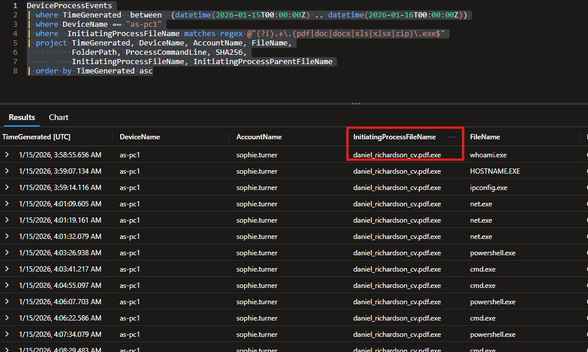

**Analyst Assessment:**
The deliberate targeting of a recruitment organisation with a CV-themed lure demonstrates pre-operational intelligence gathering. The attacker understood the environment and weaponised a file type that would be routinely opened without suspicion. This is the entry point for the entire compromise chain.

---

### 🚩 F02 — Payload Hash Confirmed

| Field | Detail |
|---|---|
| **Severity** | 🔴 Critical |
| **MITRE Tactic** | Initial Access (TA0001) |
| **MITRE Technique** | Phishing: Spearphishing Attachment (T1566.001) |
| **Host Affected** | as-pc1 |
| **Confidence** | High |

**What Was Found:**
The SHA256 hash of the initial payload was confirmed as `48b97fd91946e81e3e7742b3554585360551551cbf9398e1f34f4bc4eac3a6b5`. This hash is significant beyond the initial access stage — it reappears in Section 7 as the hash of `RuntimeBroker.exe`, confirming the attacker reused the same binary for both initial access and scheduled task persistence.

**KQL Query Used:**

```kql
DeviceProcessEvents
| where TimeGenerated  between  (datetime(2026-01-15T00:00:00Z) .. datetime(2026-01-16T00:00:00Z))
| where DeviceName =~ "as-pc1"
| where  InitiatingProcessFileName matches regex @"(?i).+\.(pdf|doc|docx|xls|xlsx|zip)\.exe$"
| project TimeGenerated, DeviceName, AccountName, InitiatingProcessSHA256, InitiatingProcessFileName
| order by TimeGenerated asc
```

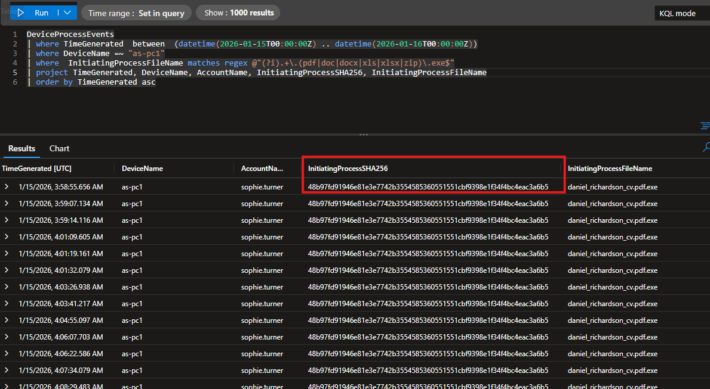

**Analyst Assessment:**
Hash confirmation is critical for threat intelligence enrichment and cross-host hunting. The reuse of this binary hash across initial access (F01) and persistence (F30) indicates a single-toolkit intrusion, simplifying detection — any instance of this hash anywhere in the environment should be treated as a confirmed compromise indicator.

---

### 🚩 F03 — User Interaction via Explorer

| Field | Detail |
|---|---|
| **Severity** | 🟠 High |
| **MITRE Tactic** | Execution (TA0002) |
| **MITRE Technique** | User Execution: Malicious File (T1204.002) |
| **Host Affected** | as-pc1 |
| **Confidence** | High |

**What Was Found:**
The parent process of `Daniel_Richardson_CV.pdf.exe` was `explorer.exe`, confirming that a user directly double-clicked the file from Windows Explorer. This rules out automated execution methods (e.g. scheduled tasks, scripted delivery) and confirms human interaction as the trigger. The user on as-pc1 was operating under the `sophie.turner` account.

**KQL Query Used:**

```kql
DeviceProcessEvents
| where TimeGenerated  between  (datetime(2026-01-15T00:00:00Z) .. datetime(2026-01-20T00:00:00Z))
| where DeviceName =~ "as-pc1"
| where InitiatingProcessFileName contains "Daniel_Richardson_CV.pdf.exe"
| project TimeGenerated, DeviceName, AccountName,
          InitiatingProcessFileName, InitiatingProcessParentFileName
| order by TimeGenerated asc
```

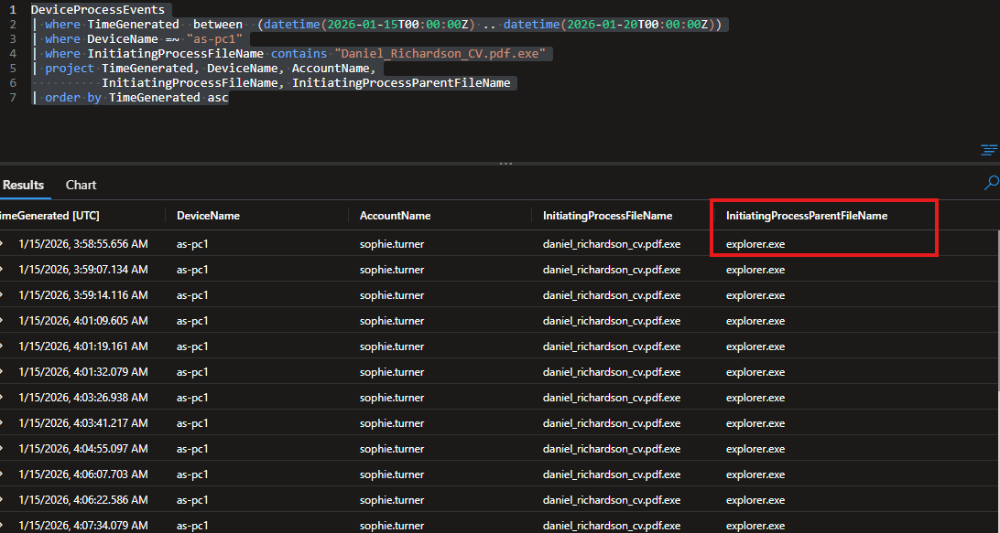

**Analyst Assessment:**
User execution via Explorer is the most common delivery mechanism for phishing payloads. The `sophie.turner` account was used, meaning all subsequent activity in this section executes under her privilege context. This confirms a successful social engineering component and points to a need for user awareness training targeting recruitment staff.

---

### 🚩 F04 — Suspicious Child Process Spawned

| Field | Detail |
|---|---|
| **Severity** | 🔴 Critical |
| **MITRE Tactic** | Defense Evasion (TA0005) |
| **MITRE Technique** | Process Injection (T1055) |
| **Host Affected** | as-pc1 |
| **Confidence** | High |

**What Was Found:**
The malicious payload `Daniel_Richardson_CV.pdf.exe` spawned `notepad.exe` as a child process. A CV file spawning Notepad as a child process is highly anomalous — legitimate PDF or document applications do not behave this way. This strongly indicates process hollowing, injection staging, or the use of `notepad.exe` as a host process for in-memory payload execution. This same process reappears in F40 as the injection host for SharpChrome.

**KQL Query Used:**

```kql
DeviceProcessEvents
| where TimeGenerated  between (datetime(2026-01-15) .. datetime(2026-01-20))
| where DeviceName =~ "as-pc1"
| where InitiatingProcessFileName =~ "Daniel_Richardson_CV.pdf.exe"
    or InitiatingProcessSHA256 == "48b97fd91946e81e3e7742b3554585360551551cbf9398e1f34f4bc4eac3a6b5"
| project TimeGenerated, DeviceName, AccountName, FileName,
          ProcessCommandLine, SHA256,
          InitiatingProcessFileName, InitiatingProcessCommandLine
| order by TimeGenerated asc
```

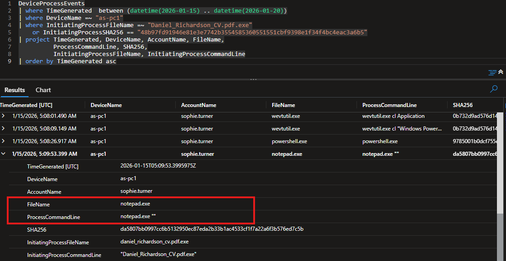

**Analyst Assessment:**
The spawning of `notepad.exe` by a document-mimicking executable is a strong indicator of malicious injection staging. Legitimate software never follows this parent-child relationship. The consistent use of `notepad.exe` across the intrusion (F04, F05, F40) confirms it was deliberately selected as a trusted host process to blend malicious activity within a known-good application.

---

### 🚩 F05 — Empty Argument Process Masquerade

| Field | Detail |
|---|---|
| **Severity** | 🔴 Critical |
| **MITRE Tactic** | Defense Evasion (TA0005) |
| **MITRE Technique** | Masquerading (T1036) |
| **Host Affected** | as-pc1 |
| **Confidence** | High |

**What Was Found:**
The spawned `notepad.exe` process executed with the command line `notepad.exe ""` — empty double quotes as the argument. Legitimate Notepad usage either has no arguments (opens blank) or a filename argument. Empty quotes passed to Notepad serve no user-facing purpose and are a known indicator of process masquerading or hollow process preparation, where the process is launched in a suspended state with artificial arguments before its memory is replaced with malicious code.

**KQL Query Used:**

```kql
DeviceProcessEvents
| where TimeGenerated  between (datetime(2026-01-15) .. datetime(2026-01-20))
| where DeviceName =~ "as-pc1"
| where InitiatingProcessFileName =~ "Daniel_Richardson_CV.pdf.exe"
    or InitiatingProcessSHA256 == "48b97fd91946e81e3e7742b3554585360551551cbf9398e1f34f4bc4eac3a6b5"
| project TimeGenerated, DeviceName, AccountName, FileName,
          ProcessCommandLine, SHA256,
          InitiatingProcessFileName, InitiatingProcessCommandLine
| order by TimeGenerated asc
```

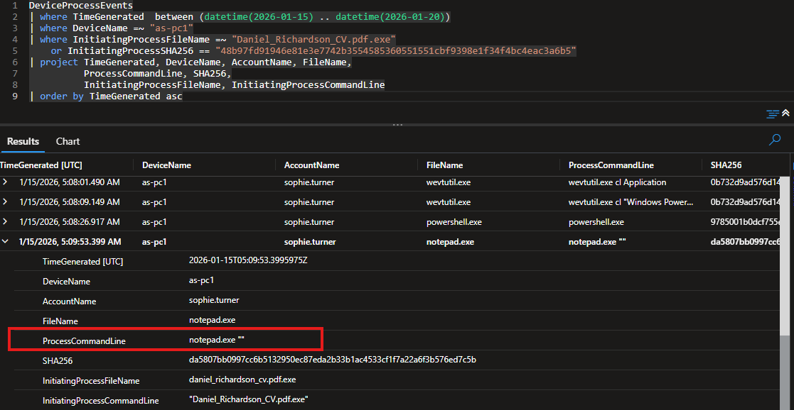

**Analyst Assessment:**
The `notepad.exe ""` command line is a high-fidelity indicator of malicious intent. No legitimate user or application spawns Notepad with empty quoted arguments. This specific pattern should be deployed as a detection rule across the environment. The ProcessId from this event should be correlated with the `ClrUnbackedModuleLoaded` event in F38/F40 to confirm injection continuity.

---

## SECTION 2 — COMMAND & CONTROL

---

### 🚩 F06 — C2 Domain Established

| Field | Detail |
|---|---|
| **Severity** | 🔴 Critical |
| **MITRE Tactic** | Command & Control (TA0011) |
| **MITRE Technique** | Application Layer Protocol: Web Protocols (T1071.001) |
| **Host Affected** | as-pc1 |
| **Confidence** | High |

**What Was Found:**
Outbound network connections were confirmed to `cdn.cloud-endpoint.net`, the primary C2 domain used by the attacker. The CDN-like subdomain naming (`cdn`) is a deliberate attempt to blend adversary infrastructure with legitimate content delivery network traffic patterns, reducing the likelihood of proxy or firewall alerts triggering on the domain.

**KQL Query Used:**

```kql
let start = datetime(2026-01-15T00:00:00Z);
let end   = datetime(2026-01-16T00:00:00Z);
DeviceNetworkEvents
| where DeviceName =~ "as-pc1"
| where TimeGenerated between (start..end)
| where ActionType in ("ConnectionSuccess","ConnectionAttempt")
| where isnotempty(RemoteUrl)
| summarize Hits=count() by RemoteUrl, InitiatingProcessFileName
```

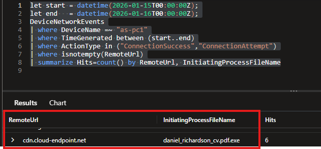

**Analyst Assessment:**
The use of a CDN-spoofing domain name indicates pre-planned infrastructure and awareness of common network monitoring practices. Active C2 confirms this is an operator-controlled intrusion. The domain should be blocked at DNS and perimeter firewall immediately, and all other hosts in the environment should be queried for connections to `cloud-endpoint.net`.

---

### 🚩 F07 — C2 Initiating Process Identified

| Field | Detail |
|---|---|
| **Severity** | 🔴 Critical |
| **MITRE Tactic** | Command & Control (TA0011) |
| **MITRE Technique** | Application Layer Protocol: Web Protocols (T1071.001) |
| **Host Affected** | as-pc1 |
| **Confidence** | High |

**What Was Found:**
The process responsible for initiating C2 communications was confirmed as `daniel_richardson_cv.pdf.exe` (lowercase as recorded in telemetry). This directly links the initial access payload to the C2 activity, confirming the binary is not just a dropper but an active implant maintaining persistent communication with adversary infrastructure.

**KQL Query Used:**

```kql
DeviceNetworkEvents
| where Timestamp between (datetime(2026-01-15) .. datetime(2026-01-20))
| where DeviceName =~ "as-pc1"
| where InitiatingProcessFileName =~ "daniel_richardson_cv.pdf.exe"
| project Timestamp, DeviceName, ActionType, RemoteUrl,
          RemoteIP, RemotePort, Protocol,
          InitiatingProcessFileName, InitiatingProcessSHA256,
          InitiatingProcessAccountName
| order by Timestamp asc
```

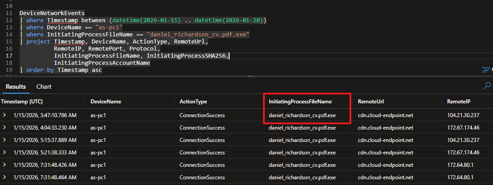

**Analyst Assessment:**
Confirming the initiating process closes the loop between the execution chain (F01–F05) and the network activity. The payload acts as a full implant — not merely a dropper that delivers another tool. This means as long as the process is running, the attacker has live access to the compromised host.

---

### 🚩 F08 — Payload Staging Infrastructure

| Field | Detail |
|---|---|
| **Severity** | 🔴 Critical |
| **MITRE Tactic** | Command & Control (TA0011) |
| **MITRE Technique** | Ingress Tool Transfer (T1105) |
| **Host Affected** | as-pc1 |
| **Confidence** | High |

**What Was Found:**
A secondary domain `sync.cloud-endpoint.net` was used for payload staging — hosting additional tools, payloads, or modules pulled down post-compromise. The `sync` subdomain naming mirrors legitimate cloud synchronisation services, again attempting to blend with expected enterprise traffic. Both C2 and staging domains share the parent domain `cloud-endpoint.net`, confirming unified adversary infrastructure.

**KQL Query Used:**

```kql
DeviceNetworkEvents
| where Timestamp between (datetime(2026-01-15) .. datetime(2026-01-20))
| where RemoteUrl has "endpoint.net"
| project Timestamp, DeviceName, ActionType, RemoteUrl,
          RemoteIP, RemotePort, Protocol,
          InitiatingProcessFileName, InitiatingProcessCommandLine
| order by Timestamp asc
```

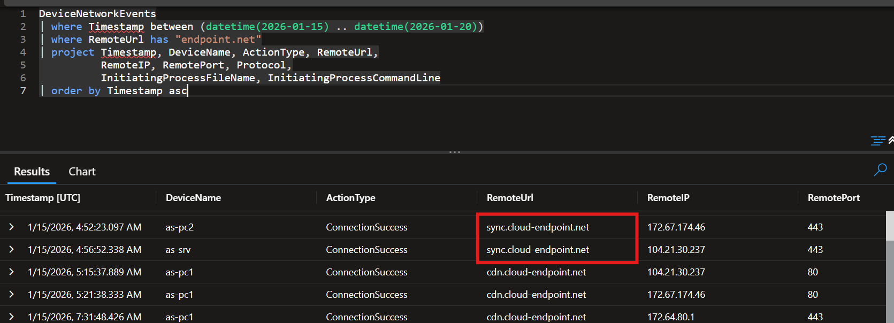

**Analyst Assessment:**
The use of separate C2 and staging subdomains indicates organised infrastructure management. The staging domain likely served AnyDesk, SharpChrome, or other tools downloaded during the intrusion. Both domains must be blocked and the full `cloud-endpoint.net` domain should be sinkholed or added to threat intelligence feeds.

---

## SECTION 3 — CREDENTIAL ACCESS

---

### 🚩 F09 — SAM & SYSTEM Hives Targeted

| Field | Detail |
|---|---|
| **Severity** | 🔴 Critical |
| **MITRE Tactic** | Credential Access (TA0006) |
| **MITRE Technique** | OS Credential Dumping: Security Account Manager (T1003.002) |
| **Host Affected** | as-pc1 |
| **Confidence** | High |

**What Was Found:**
The attacker used `reg save` commands to export the `SAM` and `SYSTEM` registry hives. The SAM hive contains NTLM password hashes for all local user accounts. The SYSTEM hive contains the boot key (SysKey) required to decrypt the SAM database. Together, these two hives provide everything needed for offline password cracking or pass-the-hash attacks against all local accounts.

**KQL Query Used:**

```kql
DeviceProcessEvents
| where Timestamp between (datetime(2026-01-15) .. datetime(2026-01-20))
| where DeviceName =~ "as-pc1"
| where FileName =~ "reg.exe"
    and ProcessCommandLine has "save"
    and ProcessCommandLine has_any ("SAM", "SYSTEM", "SECURITY", "NTDS")
| project Timestamp, DeviceName, AccountName, FileName,
          ProcessCommandLine, InitiatingProcessFileName,
          InitiatingProcessCommandLine, InitiatingProcessSHA256
| order by Timestamp asc
```

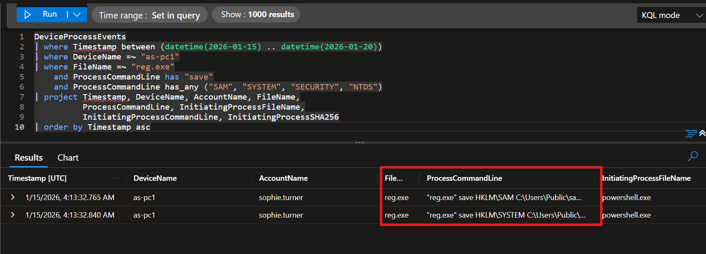

**Analyst Assessment:**
This is the pivotal stage that converted a single-host compromise into an enterprise threat. The extracted credential material directly enabled the lateral movement in Section 6. All local account credentials on as-pc1 must be treated as fully compromised. Domain credentials cached on this host are also at risk.

---

### 🚩 F10 — Credential Files Staged Locally

| Field | Detail |
|---|---|
| **Severity** | 🟠 High |
| **MITRE Tactic** | Credential Access (TA0006) |
| **MITRE Technique** | OS Credential Dumping: Security Account Manager (T1003.002) |
| **Host Affected** | as-pc1 |
| **Confidence** | High |

**What Was Found:**
The exported hive files were saved to `C:\Users\Public`, a directory that is world-readable and writable by all users on the system. This is a common attacker choice for interim staging because it does not require elevated privileges to write files and is less likely to be monitored than system directories. Files in this location could subsequently be exfiltrated via the C2 channel or retrieved remotely via AnyDesk.

**KQL Query Used:**

```kql
DeviceProcessEvents
| where Timestamp between (datetime(2026-01-15) .. datetime(2026-01-20))
| where DeviceName =~ "as-pc1"
| where FileName =~ "reg.exe"
    and ProcessCommandLine has "save"
    and ProcessCommandLine has_any ("SAM", "SYSTEM", "SECURITY", "NTDS")
| project Timestamp, DeviceName, AccountName, FileName,
          ProcessCommandLine, InitiatingProcessFileName,
          InitiatingProcessCommandLine, InitiatingProcessSHA256
| order by Timestamp asc
```

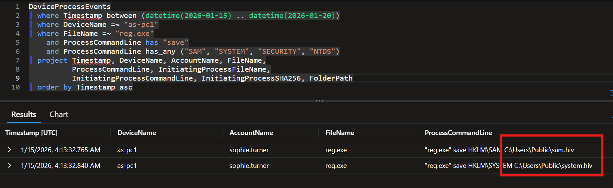

**Analyst Assessment:**
The staging of credential files in `C:\Users\Public` is a deliberate operational choice. Any subsequent network activity from this host carrying files of unusual size from this path should be investigated as potential credential exfiltration. Monitoring `C:\Users\Public` for binary or hive file drops should be a standing detection rule.

---

### 🚩 F11 — Execution Identity Confirmed

| Field | Detail |
|---|---|
| **Severity** | 🟠 High |
| **MITRE Tactic** | Credential Access (TA0006) |
| **MITRE Technique** | OS Credential Dumping: Security Account Manager (T1003.002) |
| **Host Affected** | as-pc1 |
| **Confidence** | High |

**What Was Found:**
The credential extraction commands were executed under the user context of `sophie.turner`. This confirms the initial payload ran with her account privileges, and that no privilege escalation was required to dump registry hives — indicating `sophie.turner` had sufficient local rights for this operation, or that the attacker exploited her session context directly.

**KQL Query Used:**

```kql
DeviceProcessEvents
| where Timestamp between (datetime(2026-01-15) .. datetime(2026-01-20))
| where DeviceName =~ "as-pc1"
| where AccountName =~ "sophie.turner"
    and ProcessCommandLine has_any ("reg save", "SAM", "SYSTEM")
| project Timestamp, DeviceName, AccountName, FileName,
          ProcessCommandLine, LogonId,
          InitiatingProcessFileName
| order by Timestamp asc
```

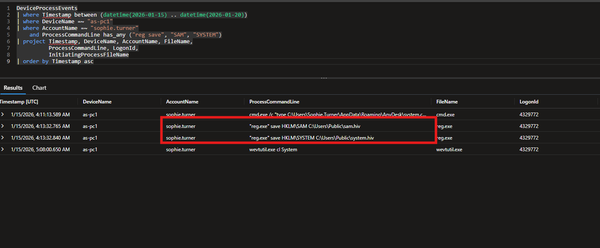

**Analyst Assessment:**
Identifying `sophie.turner` as the execution identity confirms her account is fully compromised and her credentials should be reset immediately. Her account having sufficient privileges to dump registry hives suggests overly permissive local rights. A review of local administrator group membership on as-pc1 is recommended.

---

## SECTION 4 — DISCOVERY

---

### 🚩 F12 — User Context Confirmed via whoami

| Field | Detail |
|---|---|
| **Severity** | 🟡 Medium |
| **MITRE Tactic** | Discovery (TA0007) |
| **MITRE Technique** | System Owner/User Discovery (T1033) |
| **Host Affected** | as-pc1 |
| **Confidence** | High |

**What Was Found:**
`whoami.exe` was executed on as-pc1, confirming the attacker checked their active user identity post-compromise. This is standard operator tradecraft performed to verify privilege level and username before proceeding with further actions. The result would have confirmed the attacker was operating as `sophie.turner`.

**KQL Query Used:**

```kql
DeviceProcessEvents
| where Timestamp between (datetime(2026-01-15) .. datetime(2026-01-20))
| where DeviceName =~ "as-pc1"
| where FileName =~ "whoami.exe"
    and InitiatingProcessFileName !in~ ("cmd.exe", "powershell.exe",
                                         "services.exe", "svchost.exe")
| project Timestamp, DeviceName, AccountName, FileName,
          ProcessCommandLine, InitiatingProcessFileName,
          InitiatingProcessCommandLine
| order by Timestamp asc
```

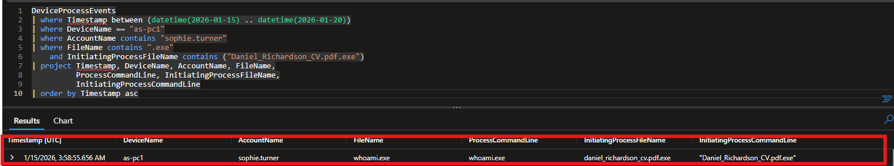

**Analyst Assessment:**
While `whoami.exe` is a low-severity individual event, in context it confirms active operator presence performing manual reconnaissance. When correlated with the surrounding credential dump and discovery activity, it forms part of a clear situational awareness phase immediately preceding lateral movement.

---

### 🚩 F13 — Network Share Enumeration

| Field | Detail |
|---|---|
| **Severity** | 🟠 High |
| **MITRE Tactic** | Discovery (TA0007) |
| **MITRE Technique** | Network Share Discovery (T1135) |
| **Host Affected** | as-pc1 |
| **Confidence** | High |

**What Was Found:**
`net.exe view` was executed to enumerate network resources and shared drives visible from as-pc1. This command lists all computers and shared resources visible on the network, allowing the attacker to identify file servers, shared drives, and potential data repositories to target — directly informing the subsequent targeting of financial data on as-srv (F32).

**KQL Query Used:**

```kql
DeviceProcessEvents
| where Timestamp between (datetime(2026-01-15) .. datetime(2026-01-20))
| where DeviceName =~ "as-pc1"
| where AccountName contains "sophie.turner"
| where FileName contains "net.exe"
    and InitiatingProcessFileName contains ("Daniel_Richardson_CV.pdf.exe")
| project Timestamp, DeviceName, AccountName, FileName,
          ProcessCommandLine, InitiatingProcessFileName,
          InitiatingProcessCommandLine
| order by Timestamp asc
```

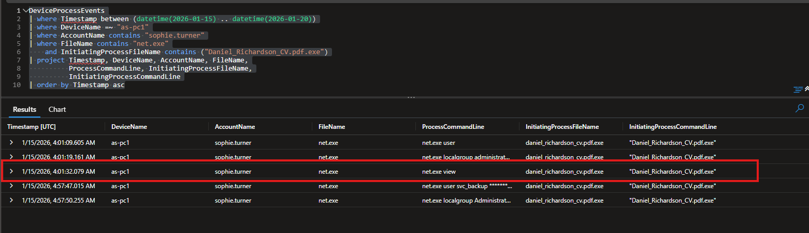

**Analyst Assessment:**
Network share enumeration at this stage of the attack chain directly informed the attacker's targeting decision in Section 8. The identified file server as-srv likely appeared in the `net view` output, directing subsequent lateral movement toward that host. Share enumeration from non-admin processes should trigger an alert in production.

---

### 🚩 F14 — Local Administrators Group Queried

| Field | Detail |
|---|---|
| **Severity** | 🟠 High |
| **MITRE Tactic** | Discovery (TA0007) |
| **MITRE Technique** | Account Discovery: Local Account (T1087.001) |
| **Host Affected** | as-pc1 |
| **Confidence** | High |

**What Was Found:**
The local `administrators` group was enumerated using `net localgroup administrators`. This reveals all accounts with local administrator privileges on as-pc1, providing the attacker with a list of high-value credential targets. This likely contributed to the targeting of `david.mitchell`'s account for lateral movement (F25–F27).

**KQL Query Used:**

```kql
DeviceProcessEvents
| where Timestamp between (datetime(2026-01-15) .. datetime(2026-01-20))
| where DeviceName =~ "as-pc1"
| where AccountName contains "sophie.turner"
| where FileName contains "net.exe"
    and InitiatingProcessFileName contains ("Daniel_Richardson_CV.pdf.exe")
| project Timestamp, DeviceName, AccountName, FileName,
          ProcessCommandLine, InitiatingProcessFileName,
          InitiatingProcessCommandLine
| order by Timestamp asc
```

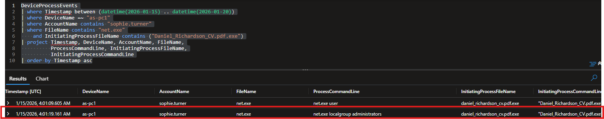

**Analyst Assessment:**
Administrators group enumeration is a high-value reconnaissance step that directly enables privilege escalation and targeted credential theft. The output of this command would have identified `david.mitchell` or other privileged accounts whose credentials were subsequently extracted from the SAM hive and used for lateral movement. This event in isolation warrants investigation when observed outside normal administrative workflows.

---

## SECTION 5 — PERSISTENCE: REMOTE TOOL

---

### 🚩 F15 — AnyDesk Deployed for Remote Access

| Field | Detail |
|---|---|
| **Severity** | 🔴 Critical |
| **MITRE Tactic** | Persistence (TA0003) |
| **MITRE Technique** | External Remote Services (T1133) |
| **Host Affected** | as-pc1, as-pc2, as-srv |
| **Confidence** | High |

**What Was Found:**
AnyDesk — a legitimate remote desktop application — was deployed across all three hosts in the environment as a persistent remote access mechanism. The use of legitimate software for malicious persistence (living-off-the-land with trusted applications) is intentional: AnyDesk traffic is typically encrypted, uses standard HTTPS ports, and blends with legitimate remote support activity, making it significantly harder to detect than custom RAT traffic.

**KQL Query Used:**

```kql
DeviceFileEvents
| where Timestamp between (datetime(2026-01-15) .. datetime(2026-01-20))
| where FileName =~ "AnyDesk.exe"
    or FolderPath has "AnyDesk"
| project Timestamp, DeviceName, ActionType, FileName,
          FolderPath, SHA256, InitiatingProcessFileName,
          InitiatingProcessAccountName
| order by Timestamp asc
```


**Analyst Assessment:**
Enterprise-wide deployment of AnyDesk with a hardcoded unattended password provides the attacker full graphical remote access to every host in scope, independent of the original payload. Even complete remediation of the initial malware would leave this access path intact. All AnyDesk instances must be removed as an immediate priority.

---

### 🚩 F16 — AnyDesk Binary Hash Confirmed

| Field | Detail |
|---|---|
| **Severity** | 🔴 Critical |
| **MITRE Tactic** | Persistence (TA0003) |
| **MITRE Technique** | External Remote Services (T1133) |
| **Host Affected** | as-pc1, as-pc2, as-srv |
| **Confidence** | High |

**What Was Found:**
The SHA256 hash of the deployed AnyDesk binary was confirmed as `f42b635d93720d1624c74121b83794d706d4d064bee027650698025703d20532`. Hash confirmation allows definitive identification of the specific binary across all hosts and enables threat intelligence enrichment to determine if this is a trojanised or modified version of AnyDesk versus a genuine installer.

**KQL Query Used:**

```kql
DeviceFileEvents
| where Timestamp between (datetime(2026-01-15) .. datetime(2026-01-20))
| where SHA256 == "f42b635d93720d1624c74121b83794d706d4d064bee027650698025703d20532"
| project Timestamp, DeviceName, ActionType, FileName,
          FolderPath, SHA256, InitiatingProcessFileName
| order by Timestamp asc
```

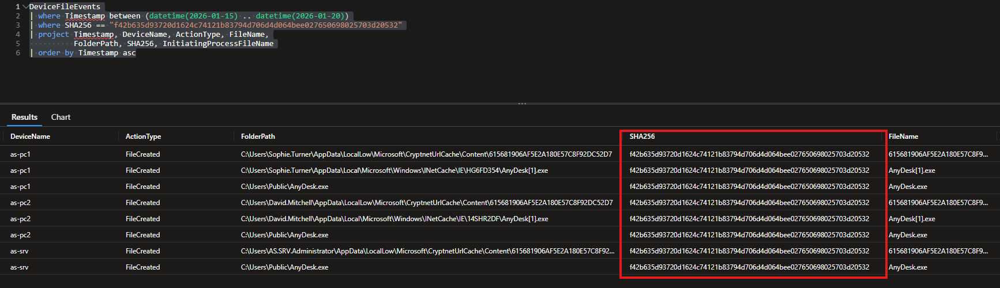

**Analyst Assessment:**
The hash should be submitted to threat intelligence platforms (with appropriate operational security) to determine if this binary is a known trojanised variant. A modified AnyDesk installer could contain additional backdoor functionality beyond standard remote access capability.

---

### 🚩 F17 — Certutil Used as Downloader (LOLBin Abuse)

| Field | Detail |
|---|---|
| **Severity** | 🔴 Critical |
| **MITRE Tactic** | Defense Evasion (TA0005) / Command & Control (TA0011) |
| **MITRE Technique** | Ingress Tool Transfer (T1105) |
| **Host Affected** | as-pc1 |
| **Confidence** | High |

**What Was Found:**
`certutil.exe` — a legitimate Windows certificate utility — was abused to download AnyDesk from external infrastructure. This is a well-documented LOLBin (Living Off the Land Binary) technique: `certutil.exe -urlcache -split -f <URL> <output>` downloads files from arbitrary URLs using a trusted, signed Windows binary that may bypass application control policies and network filtering that blocks unknown executables.

**KQL Query Used:**

```kql
DeviceProcessEvents
| where Timestamp between (datetime(2026-01-15) .. datetime(2026-01-20))
| where DeviceName =~ "as-pc1"
| where FileName =~ "certutil.exe"
    and ProcessCommandLine has_any (
        "-urlcache", "-split", "-decode", "-f",
        "http://", "https://", "ftp://"
    )
| project Timestamp, DeviceName, AccountName, FileName,
          ProcessCommandLine, InitiatingProcessFileName,
          InitiatingProcessCommandLine, InitiatingProcessSHA256
| order by Timestamp asc
```

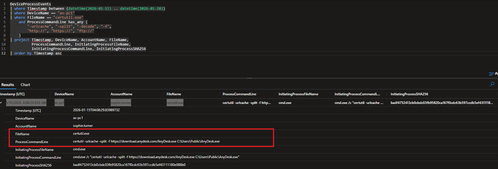

**Analyst Assessment:**
`certutil.exe` performing URL-based downloads is almost never legitimate in a managed enterprise environment. This should be an immediate, high-confidence alert in any SIEM or EDR. The download URL (from the staging domain `sync.cloud-endpoint.net`) should be documented and blocked. ASR rules can be configured to block certutil from making network connections.

---

### 🚩 F18 — AnyDesk Configuration File Accessed

| Field | Detail |
|---|---|
| **Severity** | 🟠 High |
| **MITRE Tactic** | Persistence (TA0003) |
| **MITRE Technique** | External Remote Services (T1133) |
| **Host Affected** | as-pc1 |
| **Confidence** | High |

**What Was Found:**
The AnyDesk configuration file at `C:\Users\Sophie.Turner\AppData\Roaming\AnyDesk\system.conf` was accessed and modified after installation. This file controls AnyDesk's operational behaviour, including unattended access settings, passwords, and connection permissions. Modification of this file confirms deliberate configuration for persistent, unattended remote access.

**KQL Query Used:**

```kql
DeviceProcessEvents
| where TimeGenerated between (datetime(2026-01-15T00:00:00Z) .. datetime(2026-01-16T23:59:59Z))
| where DeviceName has_any ("as-pc2", "as-pc1", "as-srv")
| where ProcessCommandLine contains ".conf"
| project TimeGenerated, DeviceName, AccountName, FileName, ProcessCommandLine, ActionType
| order by TimeGenerated asc
```

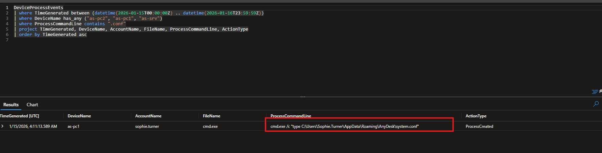

**Analyst Assessment:**
The specific targeting of the AnyDesk configuration file confirms intentional persistence configuration rather than opportunistic tool installation. The path under `sophie.turner`'s AppData further confirms her account context was used throughout this phase.

---

### 🚩 F19 — Unattended Access Password Set

| Field | Detail |
|---|---|
| **Severity** | 🔴 Critical |
| **MITRE Tactic** | Persistence (TA0003) |
| **MITRE Technique** | External Remote Services (T1133) |
| **Host Affected** | as-pc1, as-pc2, as-srv |
| **Confidence** | High |

**What Was Found:**
AnyDesk was configured with the unattended access password `intrud3r!`, enabling the attacker to connect to any of the three deployed hosts at any time without requiring interaction from a local user. This transforms AnyDesk from an interactive support tool into a silent persistent backdoor accessible 24/7 from anywhere with internet connectivity.

**KQL Query Used:**

```kql
DeviceProcessEvents
| where Timestamp between (datetime(2026-01-15) .. datetime(2026-01-20))
| where FileName =~ "AnyDesk.exe"
    and ProcessCommandLine has_any ("--set-password", "--install",
                                    "--silent", "password")
| project Timestamp, DeviceName, AccountName, ProcessCommandLine,
          InitiatingProcessCommandLine
| order by Timestamp asc
```

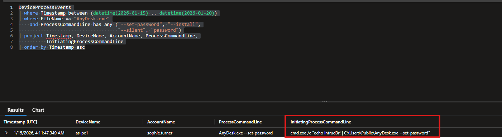

**Analyst Assessment:**
The password `intrud3r!` should be treated as a known adversary indicator. Any AnyDesk instance in the environment using this password — or any device connecting to these hosts via AnyDesk — should be investigated. The credential should also be checked against other services in the environment in case of password reuse.

---

### 🚩 F20 — AnyDesk Enterprise-Wide Deployment Footprint

| Field | Detail |
|---|---|
| **Severity** | 🔴 Critical |
| **MITRE Tactic** | Persistence (TA0003) |
| **MITRE Technique** | External Remote Services (T1133) |
| **Host Affected** | as-pc1, as-pc2, as-srv |
| **Confidence** | High |

**What Was Found:**
AnyDesk deployment was confirmed on all three hosts in the environment: **as-pc1** (initial access host), **as-pc2** (lateral movement waypoint), and **as-srv** (file server containing financial data). The enterprise-wide footprint means the attacker has persistent remote access to the complete compromised environment, including the most sensitive host.

**KQL Query Used:**

```kql
DeviceFileEvents
| where Timestamp between (datetime(2026-01-15) .. datetime(2026-01-20))
| where DeviceName in~ ("as-pc1", "as-pc2", "as-srv")
| where FileName =~ "AnyDesk.exe"
    or SHA256 == "f42b635d93720d1624c74121b83794d706d4d064bee027650698025703d20532"
| summarize DeployedHosts = make_set(DeviceName),
            FirstSeen = min(Timestamp),
            LastSeen = max(Timestamp)
            by SHA256, FileName
```

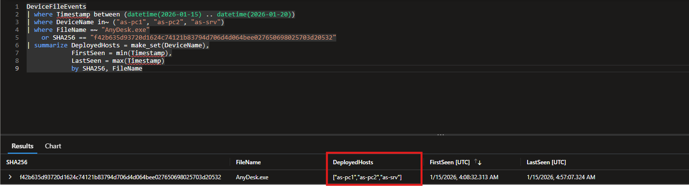

**Analyst Assessment:**
The confirmed three-host deployment footprint demonstrates the attacker's intent for long-term access across the full environment. Remediation must address all three hosts simultaneously — sequential remediation risks the attacker re-establishing access from a host that hasn't yet been cleaned.

---

## SECTION 6 — LATERAL MOVEMENT

---

### 🚩 F21 — Failed Remote Execution Attempts

| Field | Detail |
|---|---|
| **Severity** | 🟠 High |
| **MITRE Tactic** | Lateral Movement (TA0008) |
| **MITRE Technique** | Remote Services (T1021) |
| **Host Affected** | as-pc1 |
| **Confidence** | High |

**What Was Found:**
Two remote execution tools were attempted and failed: `psexec.exe` and `wmic.exe`. PsExec is a Sysinternals tool commonly used for remote command execution, and WMIC (Windows Management Instrumentation Command-line) can execute processes on remote hosts. Both failed — likely due to security controls, network filtering, or insufficient privileges at the time of attempt.

**KQL Query Used:**

```kql
DeviceProcessEvents
| where Timestamp between (datetime(2026-01-15) .. datetime(2026-01-20))
| where DeviceName =~ "as-pc1"
| where FileName in~ ("psexec.exe", "psexec64.exe", "wmic.exe")
| project Timestamp, DeviceName, AccountName, FileName,
          ProcessCommandLine, InitiatingProcessFileName,
          InitiatingProcessCommandLine
| order by Timestamp asc
```

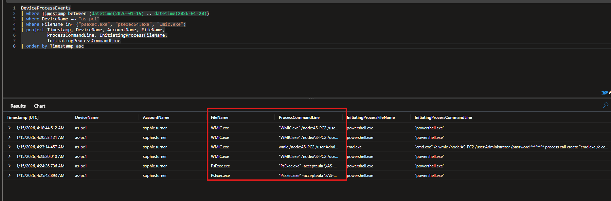

**Analyst Assessment:**
The failure of psexec and wmic indicates the environment had some level of protection against common lateral movement tools — whether through network segmentation, endpoint controls, or credential restrictions. However, the attacker adapted rather than abandoning the objective, demonstrating persistence and operational flexibility.

---

### 🚩 F22 — Target Host of Failed Attempts

| Field | Detail |
|---|---|
| **Severity** | 🟠 High |
| **MITRE Tactic** | Lateral Movement (TA0008) |
| **MITRE Technique** | Remote Services (T1021) |
| **Host Affected** | as-pc2 |
| **Confidence** | High |

**What Was Found:**
The target of the failed psexec and wmic attempts was confirmed as **as-pc2**. This is the intermediate hop in the lateral movement chain (as-pc1 → as-pc2 → as-srv). The attacker specifically targeted as-pc2 as the first pivot point, likely identified during the network enumeration phase (F13) as having access to the file server.

**KQL Query Used:**

```kql
DeviceProcessEvents
| where Timestamp between (datetime(2026-01-15) .. datetime(2026-01-20))
| where DeviceName =~ "as-pc1"
| where FileName in~ ("psexec.exe", "wmic.exe")
    and ProcessCommandLine has "as-pc2"
| project Timestamp, DeviceName, AccountName, FileName,
          ProcessCommandLine, InitiatingProcessFileName
| order by Timestamp asc
```

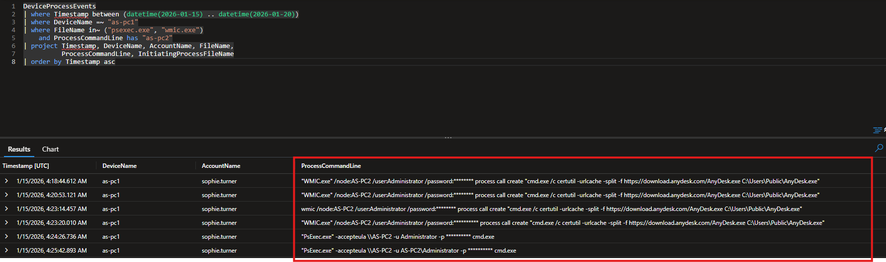

**Analyst Assessment:**
Identifying as-pc2 as the intended first pivot point confirms the attacker had already mapped the network sufficiently to know their intended movement path. The failed attempts left evidence in telemetry that the successful RDP pivot (F23) may have otherwise partially obscured.

---

### 🚩 F23 — Successful RDP Pivot

| Field | Detail |
|---|---|
| **Severity** | 🔴 Critical |
| **MITRE Tactic** | Lateral Movement (TA0008) |
| **MITRE Technique** | Remote Services: Remote Desktop Protocol (T1021.001) |
| **Host Affected** | as-pc1, as-pc2, as-srv |
| **Confidence** | High |

**What Was Found:**
After failing with psexec and wmic, the attacker successfully pivoted using `mstsc.exe` — the native Windows Remote Desktop Connection client. RDP provides full graphical desktop access, is built into Windows, and is far less likely to trigger alerts than third-party tools. The use of `mstsc.exe` with harvested credentials from the SAM dump achieved the lateral movement the attacker required.

**KQL Query Used:**

```kql
DeviceProcessEvents
| where TimeGenerated between (datetime(2026-01-15T00:00:00Z) .. datetime(2026-01-16T23:59:59Z))
| where IsProcessRemoteSession == true
| where FileName contains "mstsc.exe"
| project TimeGenerated, DeviceName, AccountName, FileName, ProcessCommandLine
| order by TimeGenerated asc
```

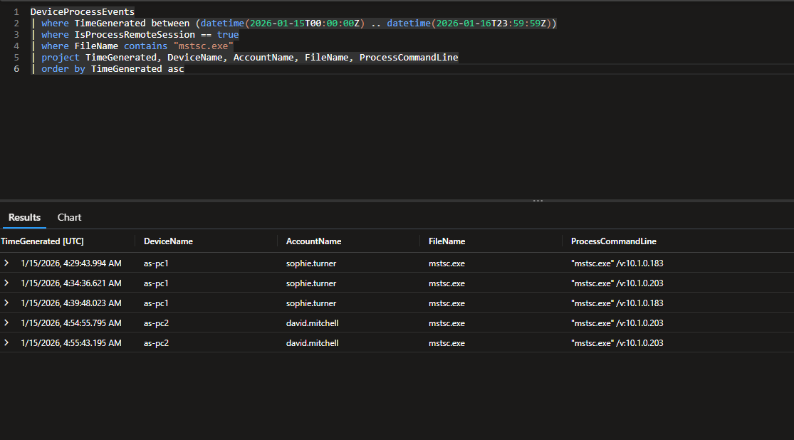

**Analyst Assessment:**
The switch from psexec/wmic to native RDP demonstrates attacker adaptability. RDP lateral movement using valid credentials is one of the hardest behaviours to detect without a strong behavioural baseline — the traffic looks identical to legitimate administrator activity. This reinforces the need for MFA on all RDP sessions.

---

### 🚩 F24 — Full Lateral Movement Path Confirmed

| Field | Detail |
|---|---|
| **Severity** | 🔴 Critical |
| **MITRE Tactic** | Lateral Movement (TA0008) |
| **MITRE Technique** | Remote Services: Remote Desktop Protocol (T1021.001) |
| **Host Affected** | as-pc1, as-pc2, as-srv |
| **Confidence** | High |

**What Was Found:**
The complete lateral movement path was confirmed as `as-pc1 → as-pc2 → as-srv`. The attacker used as-pc2 as an intermediary hop to reach the file server as-srv, which hosted the target financial data. This two-hop approach may reflect network segmentation that prevented direct access from as-pc1 to as-srv.

**KQL Query Used:**

```kql
DeviceLogonEvents
| where Timestamp between (datetime(2026-01-15) .. datetime(2026-01-20))
| where DeviceName in~ ("as-pc1", "as-pc2", "as-srv")
| project Timestamp, DeviceName, AccountName, LogonType,
          RemoteIP, ActionType
| summarize by DeviceName
```

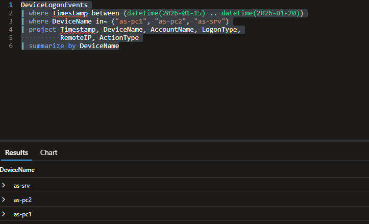

**Analyst Assessment:**
The two-hop movement path suggests the environment may have some network segmentation that restricted direct access from as-pc1 to as-srv. However, this segmentation was insufficient to prevent ultimate access to the file server. Network access controls between workstations and servers should be reviewed.

---

### 🚩 F25 — Compromised Account Used for Movement

| Field | Detail |
|---|---|
| **Severity** | 🔴 Critical |
| **MITRE Tactic** | Lateral Movement (TA0008) |
| **MITRE Technique** | Valid Accounts (T1078) |
| **Host Affected** | as-pc2, as-srv |
| **Confidence** | High |

**What Was Found:**
The account `david.mitchell` was used for all successful lateral movement authentication. This account's credentials were obtained from the SAM/SYSTEM hive dump in Section 3. The use of a valid, named user account — rather than a newly created attacker account — makes this activity significantly harder to detect, as the logon events appear legitimate from an authentication perspective.

**KQL Query Used:**

```kql
DeviceLogonEvents
| where Timestamp between (datetime(2026-01-15) .. datetime(2026-01-20))
| where AccountName =~ "david.mitchell"
| where LogonType in ("RemoteInteractive", "Network", "NetworkCleartext")
| project Timestamp, DeviceName, AccountName, LogonType,
          RemoteIP, ActionType, InitiatingProcessFileName
| order by Timestamp asc
```

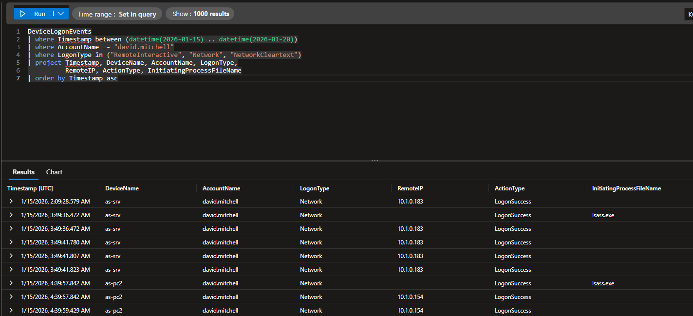

**Analyst Assessment:**
The `david.mitchell` account must be treated as fully compromised. All sessions, tokens, and cached credentials associated with this account across the environment should be invalidated immediately. The account should be disabled pending investigation and credential reset.

---

### 🚩 F26 — Disabled Account Re-Activated

| Field | Detail |
|---|---|
| **Severity** | 🔴 Critical |
| **MITRE Tactic** | Persistence (TA0003) |
| **MITRE Technique** | Valid Accounts: Local Accounts (T1078.003) |
| **Host Affected** | as-pc1 |
| **Confidence** | High |

**What Was Found:**
The `david.mitchell` account was previously disabled and was re-enabled by the attacker using the command `net user david.mitchell /active:yes`. This is a significant finding — the attacker did not merely use a credential they found; they deliberately re-enabled a dormant account, indicating they had identified it as a target of value (likely through the administrators group enumeration in F14) and understood the account state.

**KQL Query Used:**

```kql
DeviceProcessEvents
| where Timestamp between (datetime(2026-01-15) .. datetime(2026-01-20))
| where ProcessCommandLine has_all ("net", "user", "/active:yes")
    or ProcessCommandLine has_all ("net", "user", "david.mitchell")
| project Timestamp, DeviceName, AccountName, FileName,
          ProcessCommandLine, InitiatingProcessFileName,
          InitiatingProcessCommandLine
| order by Timestamp asc
```

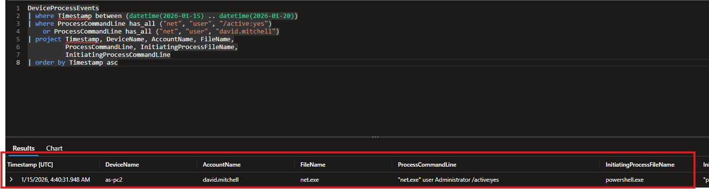

**Analyst Assessment:**
Re-enabling a disabled account is a high-fidelity, high-severity indicator of malicious activity. No legitimate business process should be re-enabling accounts via command line without change management. This event alone should be a critical alert in any SOC. The fact that `david.mitchell` was disabled suggests it was a previously deprovisioned account, making its re-activation even more suspicious.

---

### 🚩 F27 — Activation Performed Under Attacker Context

| Field | Detail |
|---|---|
| **Severity** | 🔴 Critical |
| **MITRE Tactic** | Persistence (TA0003) |
| **MITRE Technique** | Valid Accounts: Local Accounts (T1078.003) |
| **Host Affected** | as-pc1 |
| **Confidence** | High |

**What Was Found:**
The account activation command was executed under the `david.mitchell` account context — meaning the attacker used `david.mitchell`'s own credentials (obtained from the hive dump) to activate the account before using it for lateral movement. This creates a circular evidence chain: the account activated itself, which indicates the attacker already had the credential material from the offline hive extraction.

**KQL Query Used:**

```kql
DeviceProcessEvents
| where Timestamp between (datetime(2026-01-15) .. datetime(2026-01-20))
| where AccountName =~ "david.mitchell"
    and ProcessCommandLine has_any ("/active:yes", "net user", "net localgroup")
| project Timestamp, DeviceName, AccountName, FileName,
          ProcessCommandLine, LogonId, InitiatingProcessFileName
| order by Timestamp asc
```

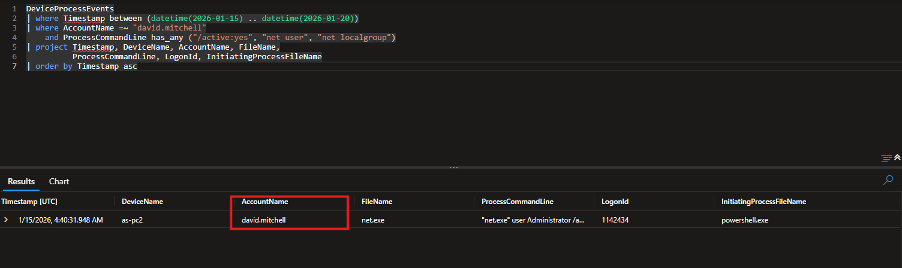

**Analyst Assessment:**
This self-activation pattern is a forensically significant indicator that confirms offline credential extraction preceded this action. The attacker extracted the hash, cracked or used it via pass-the-hash to authenticate as `david.mitchell`, then re-enabled the account for persistent interactive use. This confirms the credential dump in Section 3 was operationally successful.

---

## SECTION 7 — PERSISTENCE: SCHEDULED TASK

---

### 🚩 F28 — Scheduled Task Created

| Field | Detail |
|---|---|
| **Severity** | 🟠 High |
| **MITRE Tactic** | Persistence (TA0003) |
| **MITRE Technique** | Scheduled Task/Job: Scheduled Task (T1053.005) |
| **Host Affected** | as-pc2 |
| **Confidence** | High |

**What Was Found:**
A scheduled task named `MicrosoftEdgeUpdateCheck` was created on as-pc2. The name is deliberately chosen to impersonate a legitimate Microsoft Edge browser update task, blending with expected Windows maintenance activity. Scheduled tasks survive reboots and execute automatically, providing persistent code execution independent of active user sessions or the original C2 channel.

**KQL Query Used:**

```kql
DeviceProcessEvents
| where Timestamp between (datetime(2026-01-15) .. datetime(2026-01-20))
| where DeviceName =~ "as-pc2"
| where FileName =~ "schtasks.exe"
    and ProcessCommandLine has "/create"
| project Timestamp, DeviceName, AccountName, FileName,
          ProcessCommandLine, InitiatingProcessFileName,
          InitiatingProcessCommandLine, InitiatingProcessSHA256
| order by Timestamp asc
```


**Analyst Assessment:**
Scheduled task creation with a Microsoft-mimicking name is a well-established persistence technique. The placement on as-pc2 — the lateral movement waypoint — rather than the initial access host suggests the attacker was establishing redundant persistence at a different point in the network to survive potential remediation of as-pc1.

---

### 🚩 F29 — Payload Renamed to Evade Detection

| Field | Detail |
|---|---|
| **Severity** | 🔴 Critical |
| **MITRE Tactic** | Defense Evasion (TA0005) |
| **MITRE Technique** | Masquerading: Rename System Utilities (T1036.003) |
| **Host Affected** | as-pc2 |
| **Confidence** | High |

**What Was Found:**
The malicious payload was copied and renamed to `RuntimeBroker.exe` — a legitimate Windows process name associated with the Windows Runtime application broker. This renaming serves dual evasion purposes: the filename appears in process lists and task schedulers as a known Windows component, significantly reducing the likelihood of analyst or user investigation.

**KQL Query Used:**

```kql
DeviceFileEvents
| where Timestamp between (datetime(2026-01-15) .. datetime(2026-01-20))
| where DeviceName =~ "as-pc2"
| where FileName =~ "RuntimeBroker.exe"
    and FolderPath !startswith "C:\\Windows"  // Legitimate RuntimeBroker lives in System32
| project Timestamp, DeviceName, ActionType, FileName,
          FolderPath, SHA256, InitiatingProcessFileName,
          InitiatingProcessAccountName
| order by Timestamp asc
```


**Analyst Assessment:**
The key detection insight for this finding is path-based: legitimate `RuntimeBroker.exe` runs exclusively from `C:\Windows\System32`. Any instance of `RuntimeBroker.exe` running from any other path is definitively malicious. The hash match (F30) provides additional confirmation. Path-and-hash combination rules for known Windows process names are a high-value detection opportunity.

---

### 🚩 F30 — Persistence Binary Hash Matches Initial Payload

| Field | Detail |
|---|---|
| **Severity** | 🔴 Critical |
| **MITRE Tactic** | Persistence (TA0003) |
| **MITRE Technique** | Scheduled Task/Job: Scheduled Task (T1053.005) |
| **Host Affected** | as-pc2 |
| **Confidence** | High |

**What Was Found:**
The SHA256 hash of `RuntimeBroker.exe` (`48b97fd91946e81e3e7742b3554585360551551cbf9398e1f34f4bc4eac3a6b5`) is identical to the initial payload `Daniel_Richardson_CV.pdf.exe` identified in F02. This hash match is forensically significant — it confirms the attacker is operating a single binary toolkit, reusing the same executable across different deployment contexts with different names.

**KQL Query Used:**

```kql
DeviceFileEvents
| where Timestamp between (datetime(2026-01-15) .. datetime(2026-01-20))
| where SHA256 == "48b97fd91946e81e3e7742b3554585360551551cbf9398e1f34f4bc4eac3a6b5"
| project Timestamp, DeviceName, ActionType, FileName,
          FolderPath, SHA256, InitiatingProcessFileName
| order by Timestamp asc
```

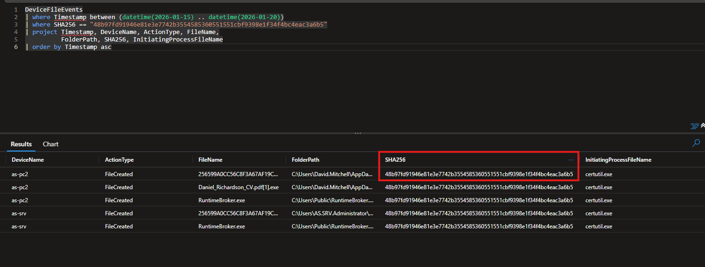

**Analyst Assessment:**
The hash match enables enterprise-wide hunting: any file with this SHA256 anywhere in the environment is malicious and part of this intrusion. This should immediately be added to EDR block lists and SIEM correlation rules. The single-binary approach simplifies remediation but confirms the attacker prioritised operational simplicity over evasion diversity.

---

### 🚩 F31 — Backdoor Account Created

| Field | Detail |
|---|---|
| **Severity** | 🔴 Critical |
| **MITRE Tactic** | Persistence (TA0003) |
| **MITRE Technique** | Create Account: Local Account (T1136.001) |
| **Host Affected** | as-pc1 |
| **Confidence** | High |

**What Was Found:**
A new local account named `svc_backup` was created on as-pc1. The service-account naming convention (`svc_`) is deliberate — it mimics legitimate service accounts commonly found in enterprise environments, reducing the likelihood of the account being flagged during routine IT audits. This account provides an authentication mechanism that survives AnyDesk removal and scheduled task deletion.

**KQL Query Used:**

```kql
DeviceProcessEvents
| where Timestamp between (datetime(2026-01-15) .. datetime(2026-01-20))
| where FileName in~ ("net.exe", "net1.exe")
    and ProcessCommandLine has_all ("user", "/add")
| project Timestamp, DeviceName, AccountName, FileName,
          ProcessCommandLine, InitiatingProcessFileName,
          InitiatingProcessCommandLine
| order by Timestamp asc
```

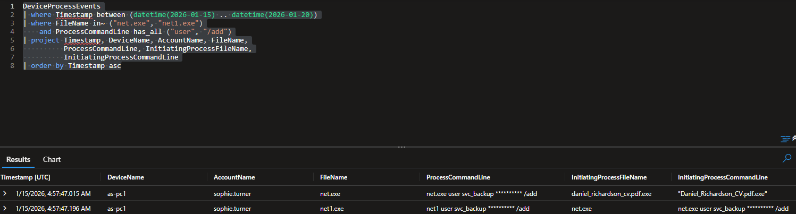

**Analyst Assessment:**
The `svc_backup` account represents the third distinct persistence mechanism deployed in this intrusion (alongside AnyDesk and the scheduled task). A thorough remediation must address all three layers simultaneously. The account should be immediately disabled and deleted, and all authentication events associated with it reviewed across the environment.

---

## SECTION 8 — DATA ACCESS

---

### 🚩 F32 — Sensitive Financial Document Accessed

| Field | Detail |
|---|---|
| **Severity** | 🔴 Critical |
| **MITRE Tactic** | Collection (TA0009) |
| **MITRE Technique** | Data from Local System (T1005) |
| **Host Affected** | as-srv |
| **Confidence** | High |

**What Was Found:**
The file `BACS_Payments_Dec2025.ods` was accessed on the file server as-srv. BACS (Bankers' Automated Clearing Service) payment files contain banking details including sort codes, account numbers, payment amounts, and beneficiary information for payroll processing. Access to this file by an unauthorised actor represents a direct financial fraud risk beyond simple data theft.

**KQL Query Used:**

```kql
DeviceFileEvents
| where Timestamp between (datetime(2026-01-15) .. datetime(2026-01-20))
| where DeviceName =~ "as-srv"
| where FileName has_any ("BACS", "Payments", "Payroll", "salary",
                          "payment", "bank", "finance")
    or FileName =~ "BACS_Payments_Dec2025.ods"
| project Timestamp, DeviceName, ActionType, FileName,
          FolderPath, InitiatingProcessFileName,
          InitiatingProcessAccountName, InitiatingProcessCommandLine
| order by Timestamp asc
```

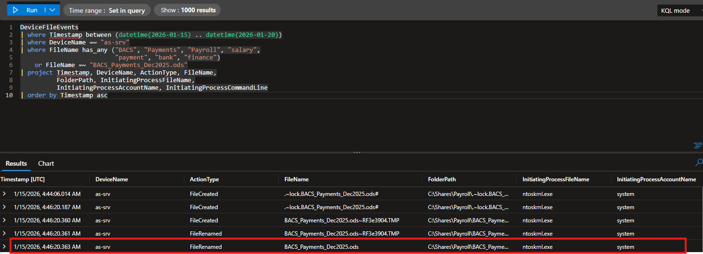

**Analyst Assessment:**
Access to BACS payment data is the clearest indicator of financial motivation in this intrusion. The finance team must be immediately notified to review December 2025 payment runs for any unauthorised modifications or redirections. Regulatory notification obligations (e.g. ICO under UK GDPR) should be assessed given the sensitivity of the accessed data.

---

### 🚩 F33 — Document Opened for Editing (Lock File Artifact)

| Field | Detail |
|---|---|
| **Severity** | 🔴 Critical |
| **MITRE Tactic** | Collection (TA0009) |
| **MITRE Technique** | Data from Local System (T1005) |
| **Host Affected** | as-srv |
| **Confidence** | High |

**What Was Found:**
A LibreOffice lock file `.~lock.BACS_Payments_Dec2025.ods#` was created alongside the main document. LibreOffice creates this lock file exclusively when a document is actively open for editing — it is not created during read-only access or file copy operations. This artifact proves the document was not merely viewed or copied; it was actively opened in an editor, raising the possibility that payment details were modified.

**KQL Query Used:**

```kql
DeviceFileEvents
| where Timestamp between (datetime(2026-01-15) .. datetime(2026-01-20))
| where DeviceName =~ "as-srv"
| where FileName startswith ".~lock."
    or (FileName has "BACS" and ActionType == "FileCreated")
| project Timestamp, DeviceName, ActionType, FileName,
          FolderPath, InitiatingProcessFileName,
          InitiatingProcessAccountName
| order by Timestamp asc
```

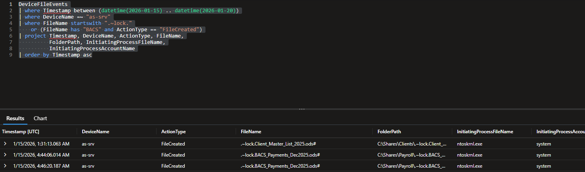

**Analyst Assessment:**
The lock file artifact is the single most significant finding for determining attacker intent. The distinction between viewing and editing is critical: if payment account numbers or amounts were modified, this is active financial fraud rather than data theft. The finance team must compare the current state of `BACS_Payments_Dec2025.ods` against backup copies from before January 15, 2026 to identify any unauthorised modifications.

---

### 🚩 F34 — Access Origin Host Identified

| Field | Detail |
|---|---|
| **Severity** | 🟠 High |
| **MITRE Tactic** | Lateral Movement (TA0008) |
| **MITRE Technique** | Remote Services: Remote Desktop Protocol (T1021.001) |
| **Host Affected** | as-pc2 |
| **Confidence** | High |

**What Was Found:**
The financial document on as-srv was accessed from **as-pc2** — confirming the attacker reached as-srv via the RDP lateral movement path and then accessed the file server's shares from as-pc2's session context. This establishes the complete data access chain: as-pc1 → (credential dump) → as-pc2 → (RDP) → as-srv → BACS_Payments_Dec2025.ods.

**KQL Query Used:**

```kql
DeviceFileEvents
| where Timestamp between (datetime(2026-01-15) .. datetime(2026-01-20))
| where FileName =~ "BACS_Payments_Dec2025.ods"
    or FileName startswith ".~lock.BACS_Payments"
| project Timestamp, DeviceName, ActionType, FileName,
          FolderPath, InitiatingProcessAccountName,
          InitiatingProcessFileName, InitiatingProcessRemoteSessionIP
| order by Timestamp asc
```

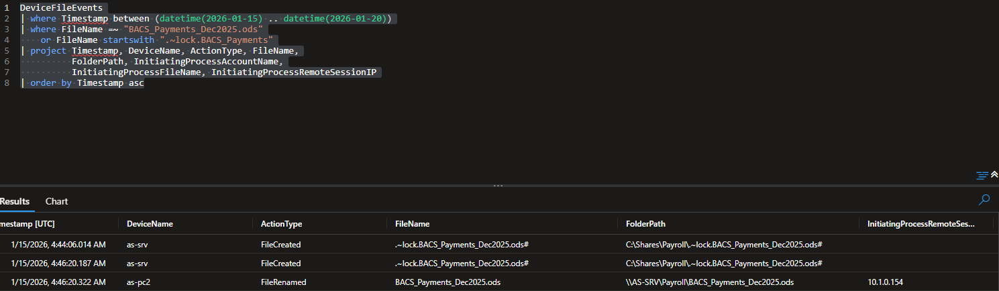

**Analyst Assessment:**
Tracing the access origin to as-pc2 completes the lateral movement chain and confirms the two-hop architecture the attacker used. This finding validates the lateral movement reconstruction in Section 6 and demonstrates that as-pc2's compromise was a deliberate waypoint toward the financial data target.

---

### 🚩 F35 — Exfiltration Archive Created

| Field | Detail |
|---|---|
| **Severity** | 🔴 Critical |
| **MITRE Tactic** | Collection (TA0009) |
| **MITRE Technique** | Archive Collected Data: Archive via Utility (T1560.001) |
| **Host Affected** | as-pc2 |
| **Confidence** | High |

**What Was Found:**
An archive file `Shares.7z` was created, packaging collected data for potential exfiltration. The use of 7-Zip format is consistent with pre-exfiltration staging behaviour — 7z provides high compression and optional encryption, reducing transfer size and potentially obscuring contents during exfiltration. The archive name `Shares.7z` suggests the contents may include data harvested from network shares.

**KQL Query Used:**

```kql
DeviceFileEvents
| where Timestamp between (datetime(2026-01-15) .. datetime(2026-01-20))
| where DeviceName in~ ("as-pc2", "as-srv")
| where FileName =~ "Shares.7z"
| project Timestamp, DeviceName, ActionType, FileName,
          FolderPath, SHA256, InitiatingProcessFileName,
          InitiatingProcessAccountName
| order by Timestamp asc
```

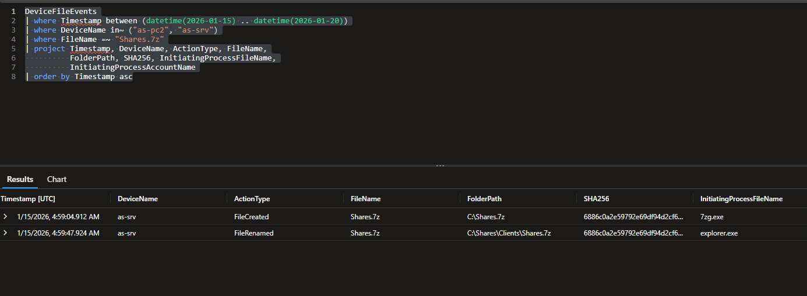

**Analyst Assessment:**
Archive creation immediately following sensitive document access is a strong pre-exfiltration indicator. Network telemetry should be reviewed for large outbound transfers from as-pc2 or as-srv following the archive creation timestamp. It is currently unknown whether exfiltration was completed — this must be determined through network log analysis.

---

### 🚩 F36 — Archive Hash Confirmed

| Field | Detail |
|---|---|
| **Severity** | 🔴 Critical |
| **MITRE Tactic** | Collection (TA0009) |
| **MITRE Technique** | Archive Collected Data: Archive via Utility (T1560.001) |
| **Host Affected** | as-pc2 |
| **Confidence** | High |

**What Was Found:**
The SHA256 hash of `Shares.7z` was confirmed as `6886c0a2e59792e69df94d2cf6ae62c2364fda50a23ab44317548895020ab048`. Hash confirmation of the archive enables tracking of this specific file if it appears elsewhere in the environment or on external infrastructure, and provides a definitive forensic identifier for the staged data package.

**KQL Query Used:**

```kql
DeviceFileEvents
| where Timestamp between (datetime(2026-01-15) .. datetime(2026-01-20))
| where SHA256 == "6886c0a2e59792e69df94d2cf6ae62c2364fda50a23ab44317548895020ab048"
| project Timestamp, DeviceName, ActionType, FileName,
          FolderPath, SHA256, InitiatingProcessFileName
| order by Timestamp asc
```

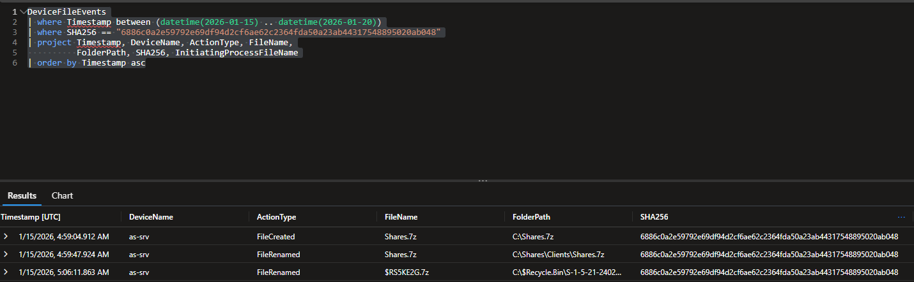

**Analyst Assessment:**
The archive hash should be retained as a primary forensic indicator. If this hash appears in network flow data (e.g. in TLS fingerprinting or proxy logs), it confirms the archive was transmitted outbound. The hash should be added to all threat intelligence platforms and shared with relevant information sharing communities under TLP:AMBER.

---

## SECTION 9 — ANTI-FORENSICS & MEMORY

---

### 🚩 F37 — Windows Event Logs Cleared

| Field | Detail |
|---|---|
| **Severity** | 🟠 High |
| **MITRE Tactic** | Defense Evasion (TA0005) |
| **MITRE Technique** | Indicator Removal: Clear Windows Event Logs (T1070.001) |
| **Host Affected** | Multi-host |
| **Confidence** | High |

**What Was Found:**
The Windows Security and System event logs were cleared across affected hosts. These logs contain authentication events, privilege use, process creation (if auditing is enabled), and system events critical to forensic reconstruction. Log clearing at the end of the attack chain is a deliberate anti-forensics measure intended to destroy evidence and impede incident response.

**KQL Query Used:**

```kql
// Log clearing process execution
DeviceProcessEvents
| where Timestamp between (datetime(2026-01-15) .. datetime(2026-01-20))
| where FileName =~ "wevtutil.exe"
    and ProcessCommandLine has_any ("cl ", "clear-log", "/c ")
| project Timestamp, DeviceName, AccountName, FileName,
          ProcessCommandLine, InitiatingProcessFileName,
          InitiatingProcessCommandLine
| order by Timestamp asc
```

```kql
// MDE-captured log clearing event
DeviceEvents
| where Timestamp between (datetime(2026-01-15) .. datetime(2026-01-20))
| where ActionType in ("SecurityLogCleared", "OtherAlertRelatedActivity")
| project Timestamp, DeviceName, ActionType,
          InitiatingProcessFileName, InitiatingProcessAccountName,
          AdditionalFields
| order by Timestamp asc
```

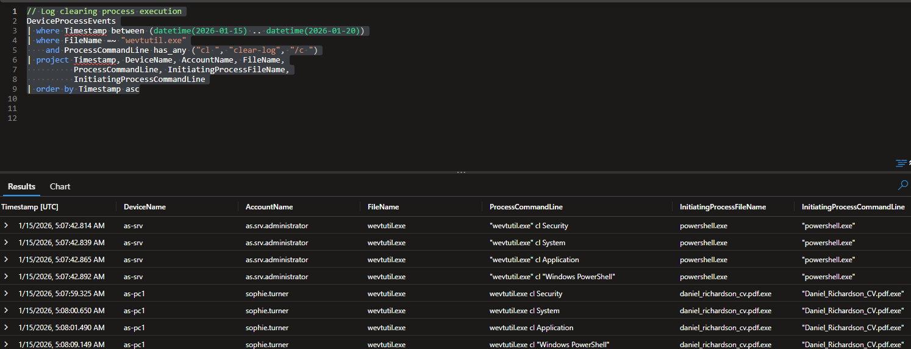

**Analyst Assessment:**
Despite the log clearing, Microsoft Defender for Endpoint streams telemetry independently to the cloud, meaning the clearing activity itself was captured — illustrating the resilience advantage of cloud-native EDR. The log clearing also indicates the attacker was aware of forensic investigation risk and took deliberate steps to impede it, further confirming a sophisticated, experienced operator.

---

### 🚩 F38 — Reflective .NET Module Loading Detected

| Field | Detail |
|---|---|
| **Severity** | 🔴 Critical |
| **MITRE Tactic** | Defense Evasion (TA0005) |
| **MITRE Technique** | Reflective Code Loading (T1620) |
| **Host Affected** | as-pc1 |
| **Confidence** | High |

**What Was Found:**
The MDE ActionType `ClrUnbackedModuleLoaded` was recorded on as-pc1. This event fires when the .NET Common Language Runtime (CLR) loads an assembly that has no corresponding file on disk — the classic signature of reflective .NET injection. The attacker loaded SharpChrome entirely in memory, bypassing any file-based antivirus or EDR disk scanning that would detect the tool if it were written to disk.

**KQL Query Used:**

```kql
DeviceEvents
| where Timestamp between (datetime(2026-01-15) .. datetime(2026-01-20))
| where DeviceName =~ "as-pc1"
| where ActionType == "ClrUnbackedModuleLoaded"
| project Timestamp, DeviceName, ActionType,
          InitiatingProcessFileName, InitiatingProcessId,
          InitiatingProcessCommandLine, InitiatingProcessAccountName,
          InitiatingProcessSHA256, AdditionalFields
| order by Timestamp asc
```

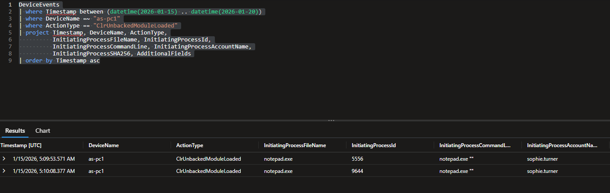

**Analyst Assessment:**
`ClrUnbackedModuleLoaded` is a high-fidelity detection signal — false positives are rare in managed enterprise environments. This event type should be alerted on as Critical in all SOC detection rules. The AdditionalFields column in this event may contain the module name or partial assembly information that further confirms SharpChrome.

---

### 🚩 F39 — SharpChrome Loaded In-Memory

| Field | Detail |
|---|---|
| **Severity** | 🔴 Critical |
| **MITRE Tactic** | Credential Access (TA0006) |
| **MITRE Technique** | Credentials from Password Stores: Credentials from Web Browsers (T1555.003) |
| **Host Affected** | as-pc1 |
| **Confidence** | High |

**What Was Found:**
SharpChrome was the specific tool loaded reflectively in F38. SharpChrome is a .NET port of Chrome credential extraction functionality, capable of decrypting and extracting saved passwords, cookies, and browser history from Chromium-based browsers (Chrome, Edge, Brave, etc.) including application-bound encryption cookies introduced in newer Chrome versions. The extracted data could include credentials for banking portals, corporate SSO, email, VPN, and any other service with saved browser credentials.

**KQL Query Used:**

```kql
DeviceEvents
| where Timestamp between (datetime(2026-01-15) .. datetime(2026-01-20))
| where DeviceName =~ "as-pc1"
| where ActionType == "ClrUnbackedModuleLoaded"
| where AdditionalFields has_any ("SharpChrome", "Chrome", "cookie",
                                   "password", "credential")
| project Timestamp, DeviceName, ActionType,
          InitiatingProcessFileName, AdditionalFields,
          InitiatingProcessAccountName
| order by Timestamp asc
```

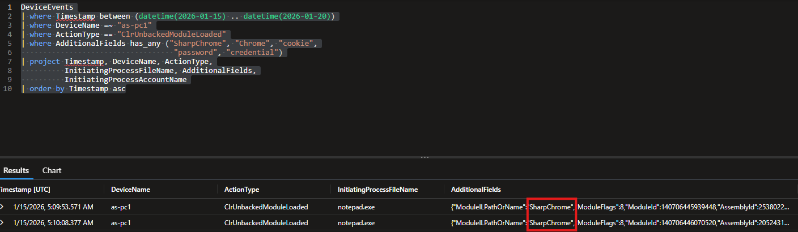

**Analyst Assessment:**
SharpChrome targeting browser credentials massively expands the credential compromise scope beyond the SAM hive dump in Section 3. Any service for which `sophie.turner` had saved browser credentials on as-pc1 must be treated as compromised. This includes corporate email, cloud services, financial platforms, and any personal accounts accessed from a work device. All such credentials should be reset immediately.

---

### 🚩 F40 — notepad.exe Confirmed as Injection Host Process

| Field | Detail |
|---|---|
| **Severity** | 🔴 Critical |
| **MITRE Tactic** | Defense Evasion (TA0005) |
| **MITRE Technique** | Process Injection (T1055) |
| **Host Affected** | as-pc1 |
| **Confidence** | High |

**What Was Found:**
`notepad.exe` was confirmed as the host process for the SharpChrome reflective injection. This is the same process spawned with empty arguments (`notepad.exe ""`) in F04 and F05 at the beginning of the intrusion, confirming the process was prepared as an injection vessel from the very first stage of execution. The full circle — from `notepad.exe ""` spawning in Section 1 to SharpChrome executing within it in Section 9 — confirms a pre-planned, single-operator attack chain.

**KQL Query Used:**

```kql
// Correlate notepad.exe PID with ClrUnbackedModuleLoaded
let SuspiciousNotepad = DeviceProcessEvents
| where Timestamp between (datetime(2026-01-15) .. datetime(2026-01-20))
| where DeviceName =~ "as-pc1"
| where FileName =~ "notepad.exe"
    and ProcessCommandLine == "notepad.exe \"\""
| project NotepadPID = ProcessId, NotepadStart = Timestamp;
DeviceEvents
| where Timestamp between (datetime(2026-01-15) .. datetime(2026-01-20))
| where DeviceName =~ "as-pc1"
| where ActionType == "ClrUnbackedModuleLoaded"
| where InitiatingProcessFileName =~ "notepad.exe"
| project Timestamp, DeviceName, ActionType,
          InitiatingProcessId, InitiatingProcessFileName,
          InitiatingProcessCommandLine, AdditionalFields
| join kind=inner SuspiciousNotepad
    on $left.InitiatingProcessId == $right.NotepadPID
```

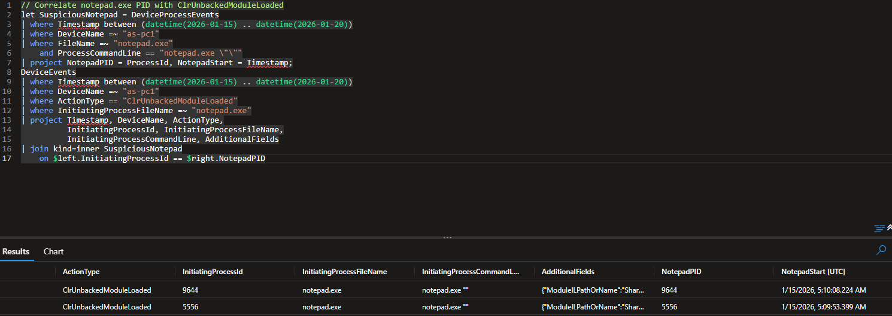

**Analyst Assessment:**
The correlation of the `notepad.exe ""` process from Section 1 with the SharpChrome injection host in Section 9 closes the full attack chain loop. This is the strongest evidence of pre-planned, operator-driven execution: `notepad.exe` was prepared as an injection vessel at the start of the intrusion and maintained that role throughout. This join query should be deployed as a persistent detection rule — the specific combination of `notepad.exe ""` spawned by a double-extension executable followed by `ClrUnbackedModuleLoaded` from the same process ID is a near-zero false-positive detection chain.

---

## 6. IOC TABLE

| # | Type | Value | Description | Flag(s) | Confidence |
|---|---|---|---|---|---|
| 1 | Filename | `Daniel_Richardson_CV.pdf.exe` | Initial phishing payload | F01, F02, F03 | High |
| 2 | SHA256 | `48b97fd91946e81e3e7742b3554585360551551cbf9398e1f34f4bc4eac3a6b5` | Payload hash — reused as RuntimeBroker.exe | F02, F30 | High |
| 3 | Process | `notepad.exe ""` | Injection staging process with empty args | F04, F05, F40 | High |
| 4 | Domain | `cdn.cloud-endpoint.net` | Primary C2 domain | F06, F07 | High |
| 5 | Domain | `sync.cloud-endpoint.net` | Payload staging domain | F08 | High |
| 6 | Domain | `cloud-endpoint.net` | Parent adversary infrastructure domain | F06, F08 | High |
| 7 | Path | `C:\Users\Public` | Credential hive staging directory | F10 | High |
| 8 | Account | `sophie.turner` | Compromised initial access account | F11, F18 | High |
| 9 | Filename | `AnyDesk.exe` | Remote access persistence tool | F15, F16 | High |
| 10 | SHA256 | `f42b635d93720d1624c74121b83794d706d4d064bee027650698025703d20532` | AnyDesk binary hash | F16 | High |
| 11 | Path | `C:\Users\Sophie.Turner\AppData\Roaming\AnyDesk\system.conf` | AnyDesk config file | F18 | High |
| 12 | Password | `intrud3r!` | AnyDesk unattended access password | F19 | High |
| 13 | Hostname | `as-pc1` | Initial compromise host | F01–F11 | High |
| 14 | Hostname | `as-pc2` | Lateral movement waypoint | F21–F27 | High |
| 15 | Hostname | `as-srv` | File server — target host | F32–F34 | High |
| 16 | Account | `david.mitchell` | Re-activated compromised account | F25, F26, F27 | High |
| 17 | Filename | `RuntimeBroker.exe` | Renamed payload for scheduled task | F29, F30 | High |
| 18 | Task Name | `MicrosoftEdgeUpdateCheck` | Malicious scheduled task | F28 | High |
| 19 | Account | `svc_backup` | Backdoor local account | F31 | High |
| 20 | Filename | `BACS_Payments_Dec2025.ods` | Targeted financial document | F32, F33 | High |
| 21 | Filename | `.~lock.BACS_Payments_Dec2025.ods#` | LibreOffice lock file — confirms editing | F33 | High |
| 22 | Filename | `Shares.7z` | Data staging archive | F35, F36 | High |
| 23 | SHA256 | `6886c0a2e59792e69df94d2cf6ae62c2364fda50a23ab44317548895020ab048` | Archive hash | F36 | High |
| 24 | Tool | `SharpChrome` | In-memory browser credential theft tool | F39 | High |
| 25 | ActionType | `ClrUnbackedModuleLoaded` | MDE detection signal for reflective .NET load | F38, F39, F40 | High |
| 26 | LOLBin | `certutil.exe` | Used to download AnyDesk from staging domain | F17 | High |
| 27 | LOLBin | `mstsc.exe` | Used for successful RDP lateral movement | F23, F24 | High |
| 28 | LOLBin | `reg.exe` | Used to dump SAM and SYSTEM hives | F09 | High |

---

## 7. MITRE ATT&CK MAPPING

| Flag | Tactic | Technique | ID | Detection Opportunity |
|---|---|---|---|---|
| F01, F02 | Initial Access | Phishing: Spearphishing Attachment | T1566.001 | Alert on double-extension executables (.pdf.exe, .doc.exe) |
| F03 | Execution | User Execution: Malicious File | T1204.002 | Monitor explorer.exe spawning non-standard executables |
| F04, F40 | Defense Evasion | Process Injection | T1055 | Alert on document processes spawning notepad.exe |
| F05 | Defense Evasion | Masquerading | T1036 | Alert on notepad.exe with empty quoted arguments |
| F06, F07 | Command & Control | Application Layer Protocol: Web Protocols | T1071.001 | DNS/proxy monitoring; alert on payload binary making network connections |
| F08, F17 | Command & Control | Ingress Tool Transfer | T1105 | Alert on certutil.exe with URL arguments; monitor downloads from unknown domains |
| F09, F10, F11 | Credential Access | OS Credential Dumping: SAM | T1003.002 | Alert on reg.exe saving SAM/SYSTEM; monitor C:\Users\Public for hive files |
| F12 | Discovery | System Owner/User Discovery | T1033 | Alert on whoami.exe from non-admin parent processes |
| F13 | Discovery | Network Share Discovery | T1135 | Alert on net.exe view from non-standard parent processes |
| F14 | Discovery | Account Discovery: Local Account | T1087.001 | Alert on net localgroup administrators enumeration |
| F15–F20 | Persistence | External Remote Services | T1133 | Alert on AnyDesk installation outside approved baseline; monitor system.conf writes |
| F21, F22 | Lateral Movement | Remote Services | T1021 | Alert on psexec.exe and wmic.exe targeting remote hosts |
| F23, F24 | Lateral Movement | Remote Services: RDP | T1021.001 | Baseline RDP usage; alert on RemoteInteractive logons from unusual sources |
| F25–F27 | Persistence / Lateral Movement | Valid Accounts: Local Accounts | T1078.003 | Alert on net user /active:yes; alert on disabled account logon events |
| F28 | Persistence | Scheduled Task/Job: Scheduled Task | T1053.005 | Alert on schtasks /create by non-admin processes |
| F29 | Defense Evasion | Masquerading: Rename System Utilities | T1036.003 | Alert on known Windows process names running from non-standard paths |
| F30, F31 | Persistence | Create Account: Local Account | T1136.001 | Alert on net user /add; monitor for unexpected local account creation |
| F32, F33 | Collection | Data from Local System | T1005 | Monitor sensitive file access; alert on .~lock. file creation near sensitive documents |
| F35, F36 | Collection | Archive Collected Data: Archive via Utility | T1560.001 | Alert on archive creation following sensitive file access |
| F37 | Defense Evasion | Indicator Removal: Clear Windows Event Logs | T1070.001 | Alert on wevtutil cl; centralise logs to immutable SIEM storage |
| F38 | Defense Evasion | Reflective Code Loading | T1620 | Alert on ClrUnbackedModuleLoaded from non-CLR host processes |
| F39 | Credential Access | Credentials from Web Browsers | T1555.003 | Alert on ClrUnbackedModuleLoaded in notepad.exe; monitor browser credential stores |

---

## 8. RECOMMENDATIONS

| Flag(s) | Immediate Action | Long-Term Fix |
|---|---|---|
| F01, F02 | Block hash `48b97fd9...` at EDR enterprise-wide; isolate as-pc1 | Deploy ASR rule blocking double-extension executable launches; user awareness training for recruitment staff |
| F03 | Enforce file extension visibility in Windows Explorer across all hosts | Implement email gateway filtering for executable attachments disguised as documents |
| F04, F05 | Hunt for all instances of `notepad.exe ""` across the estate | Deploy detection rule: document process spawning notepad.exe with empty arguments = Critical alert |
| F06, F07, F08 | Block `cloud-endpoint.net` at DNS, proxy, and perimeter firewall | Implement DNS filtering with threat intelligence feeds; alert on payload binaries initiating network connections |
| F09, F10, F11 | Rotate ALL credentials for `sophie.turner` and all local accounts on as-pc1 | Deploy Microsoft LAPS; enable Credential Guard; alert on reg.exe saving SAM/SYSTEM |
| F12, F13, F14 | Review which accounts have unnecessary local admin rights | Enforce least-privilege; deploy detection rules for recon command sequences from unusual parent processes |
| F15–F20 | Remove AnyDesk from as-pc1, as-pc2, as-srv simultaneously; block AnyDesk hash at EDR | Enforce application allowlisting; require change management for remote access tools; block AnyDesk domains at firewall |
| F21, F22 | Review why psexec/wmic were available and blocked only partially | Enforce application control to prevent psexec in non-approved contexts; block wmic remote execution |
| F23, F24 | Disable RDP on all hosts where it is not required; enforce jump-host architecture | Enforce MFA for all RDP sessions; baseline and alert on anomalous RemoteInteractive logons |
| F25–F27 | Disable `david.mitchell` immediately; reset credential; audit all its logon events | Implement account lifecycle management to prevent disabled account re-activation without approval; alert on net user /active:yes |
| F28–F30 | Delete `MicrosoftEdgeUpdateCheck` scheduled task; block hash at EDR | Alert on schtasks /create from non-admin processes; hunt for known Windows process names in non-standard paths |
| F31 | Disable and delete `svc_backup` account; audit all its activity | Alert on net user /add; review local accounts on all hosts against approved baseline |
| F32, F33 | Notify finance team immediately; compare BACS file against pre-incident backup for modifications | Implement DLP controls on financial data; restrict BACS file access to named finance accounts only; alert on .~lock. file creation |
| F35, F36 | Preserve Shares.7z hash as IOC; review network logs for outbound transfer of this file | Implement egress monitoring for large archive transfers; alert on archive creation following sensitive file access |
| F37 | Treat MDE telemetry as primary forensic record; assume local Windows logs are unreliable | Centralise all logs to immutable SIEM storage independent of endpoints; alert on wevtutil cl |
| F38–F40 | Reimage as-pc1; reset all browser-stored credentials for sophie.turner | Deploy Critical alert for ClrUnbackedModuleLoaded in non-CLR host processes; enable advanced memory threat protection |

---

## 9. CONCLUSION

The Broker represents one of the most complete adversary lifecycle reconstructions possible within a single hunt engagement. Across 40 discrete flags spanning 9 attack phases, this investigation documented a financially motivated, operator-driven enterprise intrusion from initial phishing lure through credential harvesting, enterprise persistence, multi-hop lateral movement, financial data access, and deliberate anti-forensic activity. The attacker demonstrated consistent tradecraft discipline — using LOLBins, legitimate software abuse, process masquerading, and fileless execution to minimise detection surface at every stage of the attack chain.

Analyst confidence in the reconstructed timeline is **High**, supported by corroborating telemetry across five MDE data sources: `DeviceProcessEvents`, `DeviceNetworkEvents`, `DeviceFileEvents`, `DeviceLogonEvents`, and `DeviceEvents`. The confirmed editing of `BACS_Payments_Dec2025.ods` (evidenced by the LibreOffice lock file artifact in F33) elevates this intrusion beyond data theft to a potential financial fraud incident requiring immediate notification of the finance team and assessment of regulatory reporting obligations under UK GDPR. Recommended next steps include full forensic imaging of all three affected hosts before any remediation, simultaneous removal of all three persistence layers (AnyDesk, scheduled task, svc_backup account), enterprise-wide credential rotation, and submission of all IOCs to relevant threat intelligence sharing communities under TLP:AMBER.

---

*Report prepared by: Carlos Funezsanchez | Version 3.0 | 25 February 2026*

---
*Total Flags Documented: 40 | Sections Covered: 9 | Confidence: High*
